# 20210501

# 实验索引

## 实验简介

## 实验环境

　智星云 Tesla V100-PCIE-32GB CUDA 11 PyTorch 1.7

# 实验目的

 构建合适的深度学习网络架构，利用chip-seq等技术得到20个水稻品种的表观基因组及序列数据，对模型进行训练，获得能够对未知序列的表观修饰进行预测的深度学习模型，最后利用该模型对剩余2980个品种的序列数据进行预测，画出表观基因组图谱。

# 实验背景

## 表观基因组

## 深度学习原理

### transformer

*Attention Is All You Need*


注意力（Attention）机制由Bengio团队与2014年提出并在近年广泛的应用在深度学习中的各个领域，例如在计算机视觉方向用于捕捉图像上的感受野，或者NLP中用于定位关键token或者特征。谷歌团队近期提出的用于生成词向量的BERT算法在NLP的11项任务中取得了效果的大幅提升，堪称2018年深度学习领域最振奋人心的消息。而BERT算法的最重要的部分便是本文中提出的Transformer的概念。

作者采用Attention机制的原因是考虑到RNN（或者LSTM，GRU等）的计算限制为是顺序的，也就是说RNN相关算法只能从左向右依次计算或者从右向左依次计算，这种机制带来了两个问题：

1. 时间片*t*的计算依赖*t-1*时刻的计算结果，这样限制了模型的并行能力；
2. 顺序计算的过程中信息会丢失，尽管LSTM等门机制的结构一定程度上缓解了长期依赖的问题，但是对于特别长期的依赖现象,LSTM依旧无能为力。

Transformer的提出解决了上面两个问题，首先它使用了Attention机制，将序列中的任意两个位置之间的距离是缩小为一个常量；其次它不是类似RNN的顺序结构，因此具有更好的并行性，符合现有的GPU框架。

**Self-attention**

$Z=Attention(Q,K,V)=softmax(\frac{QK^t}{\sqrt{d_k}})V$

在self-attention中，每个单词有3个不同的向量，它们分别是Query向量($Q$)，Key向量($K$)和Value向量($V$),长度均是64。它们是通过3个不同的权值矩阵由嵌入向量$X$乘以三个不同的权值矩阵$W^Q$,$W^K$,$W^V$得到，其中三个矩阵的尺寸也是相同的。均是$512\times64$。

**Feed Forward Neural Network**

$FNN(Z)=max(0,ZW_1+b_1)W_2+b_2$

即通过Relu激活函数与Linear层

**Word2Vec**

将输入转化成特征向量，词嵌入纬度$d_{model}=512$

在最底层的block中， $x$将直接作为Transformer的输入，而在其他层中，输入则是上一个block的输出.


## 实验预期

  得到对多种组蛋白修饰预测性能较高的分类器，AUC 0.95 MCC 0.75，对剩余2980个品种能够画出表观基因图谱

# 实验设计

## 算法设计

### 模型结构图

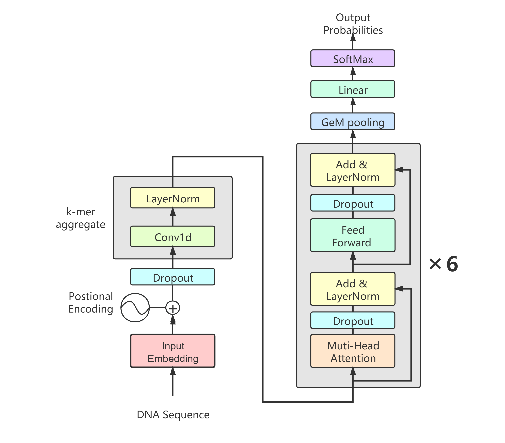

### 模型代码

#### Positional Encoding

```python
class PositionalEncoding(nn.Module):

    def __init__(self, d_model, dropout=0.1, max_len=5000):
        super(PositionalEncoding, self).__init__()
        self.dropout = nn.Dropout(p=dropout)

        pe = torch.zeros(max_len, d_model)
        position = torch.arange(0, max_len, dtype=torch.float).unsqueeze(1)
        div_term = torch.exp(torch.arange(0, d_model, 2).float() * (-math.log(10000.0) / d_model))
        pe[:, 0::2] = torch.sin(position * div_term)
        pe[:, 1::2] = torch.cos(position * div_term)
        pe = pe.unsqueeze(0).transpose(0, 1)
        self.register_buffer('pe', pe)

    def forward(self, x):
        x = x + self.pe[:x.size(0), :]
        return self.dropout(x)
```

#### K_mer_aggregate

``` python
class K_mer_aggregate(nn.Module):

    def __init__(self, kmers, in_dim, out_dim, dropout=0.1):
        super(K_mer_aggregate, self).__init__()
        self.convs = []
        for i in kmers:
            print(i)
            self.convs.append(nn.Conv1d(in_dim, out_dim, i, padding=0))
        self.convs = nn.ModuleList(self.convs)
        self.norm = nn.LayerNorm(out_dim)

    def forward(self, x):
        outputs = []
        for conv in self.convs:
            outputs.append(conv(x))
        outputs = torch.cat(outputs, dim=2)
        return self.norm(outputs.permute(2, 0, 1))
```

#### Transformer Encoder Layer

```python
class TransformerEncoderLayer(nn.Module):

    def __init__(self, d_model, nhead, dim_feedforward=2048, dropout=0.1, activation="relu"):
        super(TransformerEncoderLayer, self).__init__()
        self.self_attn = nn.MultiheadAttention(d_model, nhead, dropout=dropout)
        self.linear1 = nn.Linear(d_model, dim_feedforward)
        self.dropout = nn.Dropout(dropout)
        self.linear2 = nn.Linear(dim_feedforward, d_model)

        self.norm1 = nn.LayerNorm(d_model)
        self.norm2 = nn.LayerNorm(d_model)
        self.dropout1 = nn.Dropout(dropout)
        self.dropout2 = nn.Dropout(dropout)

        self.activation = Mish()


    def forward(self, src , src_mask = None, src_key_padding_mask = None):
        src2,attention_weights = self.self_attn(src, src, src, attn_mask=src_mask,
                              key_padding_mask=src_key_padding_mask)
        src = src + self.dropout1(src2)
        src = self.norm1(src)
        src2 = self.linear2(self.dropout(self.activation(self.linear1(src))))
        src = src + self.dropout2(src2)
        src = self.norm2(src)
        return src,attention_weights
```

#### Linear Decoder

```python
class LinearDecoder(nn.Module):
    def __init__(self, num_classes, ninp, dropout, pool=True):
        super(LinearDecoder, self).__init__()
        self.classifier = nn.Linear(ninp, num_classes)
        self.pool = pool
        self.pool_layer = GeM()

    def forward(self,x):
        if self.pool:
            x = self.pool_layer(x.permute(0, 2, 1)).permute(0, 2, 1).squeeze()
        x = self.classifier(x)
        return x
```
#### NucleicTransformer

``` python
class NucleicTransformer(nn.Module):

    def __init__(self, ntoken, nclass, ninp, nhead, nhid, nlayers, kmer_aggregation, kmers, dropout=0.5,return_aw=False):
        super(NucleicTransformer, self).__init__()
        self.model_type = 'Transformer'
        self.src_mask = None
        self.pos_encoder = PositionalEncoding(ninp, dropout)
        self.kmers = kmers
        self.kmer_aggregation = kmer_aggregation
        if self.kmer_aggregation:
            self.k_mer_aggregate = K_mer_aggregate(kmers, ninp, ninp)
        else:
            print("No kmer aggregation is chosen")
        self.transformer_encoder = []
        for i in range(nlayers):
            self.transformer_encoder.append(TransformerEncoderLayer(ninp, nhead, nhid, dropout))
        self.transformer_encoder = nn.ModuleList(self.transformer_encoder)
        self.encoder = nn.Embedding(ntoken, ninp)
        self.ninp = ninp
        self.decoder = LinearDecoder(nclass, ninp, dropout)
        self.return_aw = False

    def forward(self, src):
        src = src.permute(1,0)
        src = self.encoder(src)
        src = self.pos_encoder(src)
        if self.kmer_aggregation:
            kmer_output = self.k_mer_aggregate(src.permute(1,2,0))
            src = kmer_output
        attention_weights = []
        for layer in self.transformer_encoder:
            src,attention_weights_layer = layer(src)
            attention_weights.append(attention_weights_layer)

        encoder_output = src.permute(1, 0, 2)
        output = self.decoder(encoder_output)
        if self.return_aw:
            attention_weights = torch.stack(attention_weights).permute(1, 0, 2, 3)
            return output, attention_weights
        else:
            return output
```

## 实验具体方案

### 数据集处理及选择

#### 数据格式

| Sequence| labels|
| ---- | ----|
|CAGCTGCGGTG|0|

#### nucleotide  to int
```python
nt_int={
"A": 0,
"T": 1,
"G": 2,
"C": 3,}
def nucleatide2int(nt_sequence,target_length=None):
    int_sequence=[]
    for nt in nt_sequence:
        nt=nt.upper()
        if nt in nt_int:
            int_sequence.append(nt_int[nt])
    int_sequence=np.asarray(int_sequence,dtype='int32')
    if target_length:
        int_sequence=np.pad(int_sequence,(0,target_length-len(int_sequence)),constant_values=-1)
    return int_sequence
```

#### Dataset creation

```python
class ViraminerDataset(torch.utils.data.Dataset):
    def __init__(self,sequences,labels):
        self.data=[]
        for seq in sequences:
            self.data.append(nucleatide2int(seq))

        self.data=np.asarray(self.data,dtype='int')
        self.labels=np.asarray(labels,dtype='int')

        print(self.data.shape)
        print(self.labels.shape)

    def __len__(self):
        return len(self.labels)

    def __getitem__(self,idx):
        return {'data':self.data[idx], 'labels':self.labels[idx]}
```

### 超参数

| 超参数 | 解释 |
| ---- | ---- |
| nhead | number of heads for Multiheadattention |
| ninp | ninp for transformer encoder |
| nhid | nhid for transformer encoder |
|nlayer| number for tranformer encoder layer|
|kmers|kmers to be aggregated|

### 训练超参数

**Adam**
lr=0.001, betas=(0.9, 0.999), eps=1e-08, weight_decay=0, amsgrad=False
batch_size = 64

## 实验数据

评估指标 ACC AUC MCC

# 实验结果

## 调参

调参所用数据均为 H3K4me3

### 0503_train1

##### 参数
**原文献参数**
epochs 20 nlayers 6 batch_size 64 kmers 13 lr_scale 0.1 ninp 512  nhid 2048 num_workers 8 nhead 8

#### 各epoch结果

|epoch|train_loss|val_loss|val_auc|val_acc|val_sens|val_spec|
|----|----|----|----|----|----|----|
|1|	0.437948763|	0.392941445|	0.906085942|	0.84105|	0.8896669  |	0.792462261|
|2|	0.38110593 |    0.353913426|	0.918670828|	0.86315|	0.875762729|	0.850544837|
|3|	0.342478067|	0.329560518|	0.925454348|	0.87615|	0.870861258|	0.881435569|
|4|	0.312471211|	0.313820839|	0.930449619|	0.88465|	0.874162249|	0.895131461|
|5|	0.285765976|	0.315340996|	0.931096959|	0.88645|	0.910773232|	0.862141358|
|6|	0.263663739|	0.309209764|	0.933023174|	0.89145|	0.88886666 |	0.89403179 |
|7|	0.243981183|	0.299076527|	0.930360334|	0.8925 |    0.876362909|	0.908627412|
|8|	0.226616532|	0.29035607 |	0.937888544|	0.9033 |	0.912373712|	0.89423173 |
|9|	0.212448627|	0.286908239|	0.938575589|	0.90645|	0.913674102|	0.899230231|

#### 结果图表

**val_AUC**

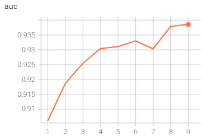

**train/val loss**

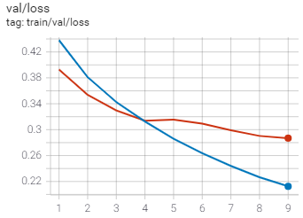

蓝线为train loss
橙线为val loss

**val_acc**

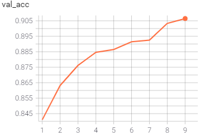

### 0503_train2

#### 参数

epochs 15 nlayers 6 batch_size 64 kmers 13 lr_scale 0.1 ninp 256  nhid 2048 num_workers 8 nhead 8 

#### 各epoch结果

|epoch|	train_loss|	val_loss	|val_auc|	val_acc|	val_sens	|val_spec|
|----|----|----|----|----|----|----|
|1|	0.469348699	|0.396611959|0.900485761|0.84005|0.831949585|0.848145556|
|2|	0.400155038	|0.37332654	|0.912198262|0.85375|0.833350005|0.874137759|
|3|	0.378302246 |0.367776334|0.912399222|0.8572	|0.876863059|0.837548735|
|4|	0.363976747	|0.34819904	|0.920103633|0.86855|0.882464739|0.854643607|
|5|	0.343172729 |0.342363238|0.927118913|0.87185|0.847154146|0.896531041|
|6|	0.325558424	|0.329765469|0.928674224|0.87805|0.882464739|0.873637909|
|7|	0.309787601	|0.3277933  |0.931308739|0.87925|0.88426528 |0.874237729|

#### 结果图表

**Val_AUC**

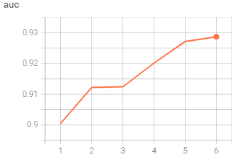

**train/val loss**

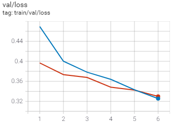
蓝线为train loss
橙线为val loss

**Val_acc**

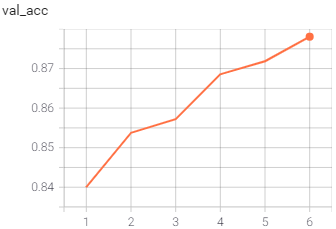

### 0503_train3

#### 参数

epochs 15 nlayers 6 batch_size 64 kmers 10 lr_scale 0.1 ninp 512  nhid 2048 num_workers 8 nhead 8 

#### 各epoch结果

|epoch|	train_loss|	val_loss|	val_auc|	val_acc|	val_sens|	val_spec|
|----|----|----|----|----|----|----|
|1	|0.438864678|0.402670801|0.902470691|0.8427 |0.824547364|0.860841747|
|2	|0.380804718|0.362423599|0.915850972|0.8586 |0.870861258|0.846346096|
|3	|0.346012145|0.330617875|0.929389334|0.8776 |0.88476543	|0.870438868|
|4	|0.318734139|0.31835103	|0.933072329|0.8831 |0.896168851|0.870038988|
|5	|0.295558542|0.319726825|0.934293624|0.8825 |0.917875363|0.847145856|
|6	|0.27359882	|0.314924002|0.939619755|0.8896 |0.867660298|0.911526542|
|7	|0.256266534|0.318452865|0.94130809	|0.8917 |0.869760928|0.913625912|
|8	|0.240265712|0.289593548|0.943980685|0.90275|0.902270681|0.903229031|
|9	|0.224720523|0.295058817|0.94264884	|0.90225|0.905071521|0.899430171|
|10	|0.212608889|0.2950899	|0.943412015|0.90325|0.924977493|0.881535539|

#### 结果图

**Val_AUC**

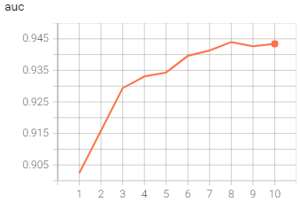

**train/val loss**

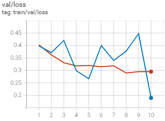

蓝线为train loss 此处loss为最后一批batch loss存在随机性
橙线为val loss


**Val_acc**

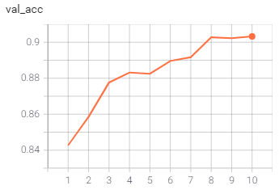

### 0504_train1

#### 参数

epochs 15 nlayers 6 batch_size 64 kmers 20 lr_scale 0.1 ninp 512  nhid 2048 num_workers 8 nhead 8 

#### 各epoch结果

|epoch|train_loss|val_loss|val_auc|val_acc|val_sens|val_spec|
|----|----|----|----|----|----|----|
|1	|0.436126709|0.381364822|0.906988812|0.84955|0.851155347|0.847945616|
|2	|0.380393207|0.361637414|0.920945673|0.8574	|0.899369811|0.815455363|
|3	|0.338541329|0.330647469|0.929417154|0.87475|0.860358107|0.88913326 |
|4	|0.305768788|0.31030333	|0.937642579|0.89025|0.912073622|0.868439468|
|5	|0.277768731|0.298810393|0.941798195|0.8929	|0.914274282|0.871538538|
|6	|0.254056126|0.30447188	|0.941344735|0.89425|0.927078123|0.861441568|
|7	|0.233569667|0.283362836|0.944638945|0.9035	|0.918675603|0.8883335  |
|8	|0.216239035|0.301086932|0.94267378 |0.9023 |0.921876563|0.882735179|
|9	|0.199241579|0.286096126|0.944725015|0.90525|0.902570771|0.907927622|


#### 结果图

**Val_AUC**

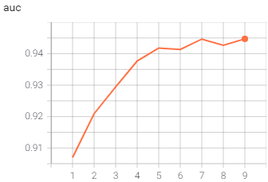

**train/val loss**

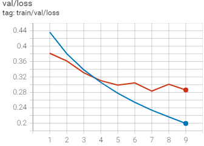

蓝线为train loss 
橙线为val loss

**Val_acc**

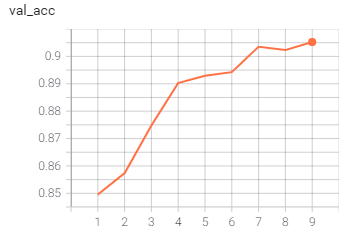

## 组间对比

## 变量参数 Kmers

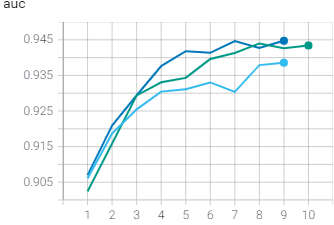

以第7epoch为指标，从上至下分别为 20, 13, 10

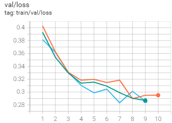

以第7epoch为指标，从上至下分别为 10, 13, 20 

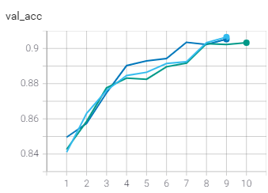

以第5 epoch，从上至下为 20, 13, 10 

### 分析

可看出kmers 为 20 时模型表现最好
