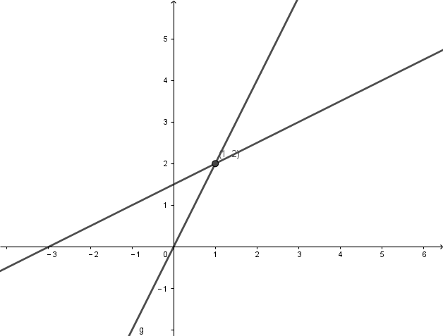
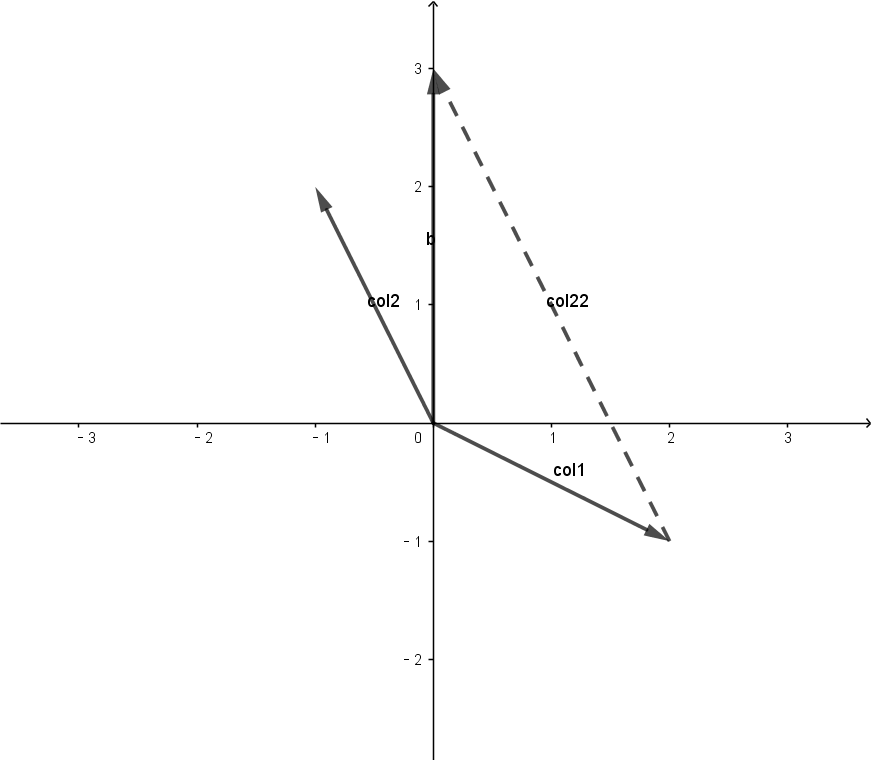
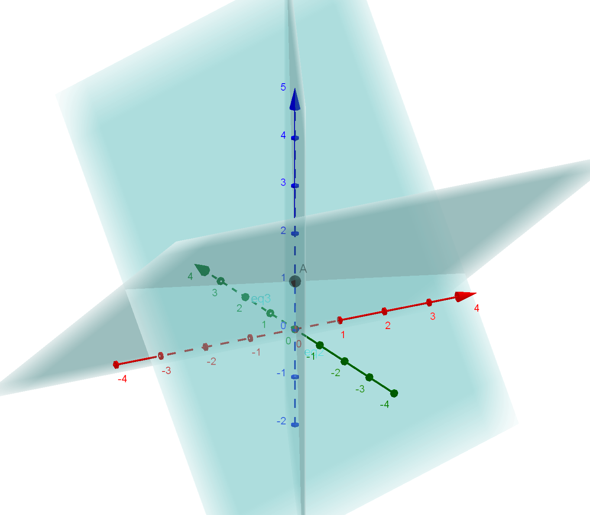
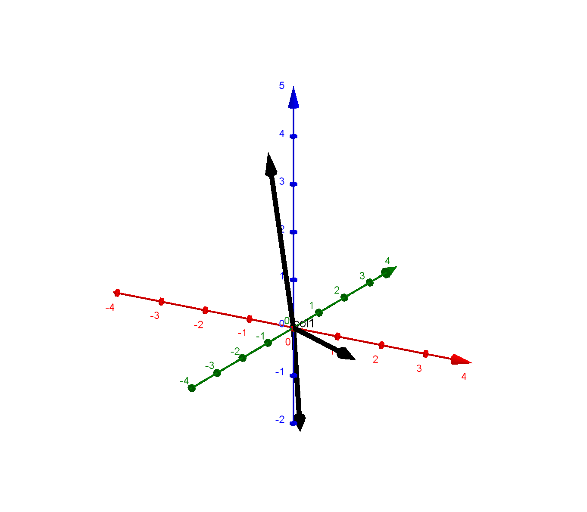

# Linear Algebra

## Lecture 1

* n linear equations, n unknowns
* Row picture
* Column picture
* Matrix form

### Example1

$$

2x-y=0\\-x+2y=3

$$

$$

\begin{bmatrix}
    2&-1\\-1&2
\end{bmatrix}
\begin{bmatrix}
    x\\y
\end{bmatrix}
=
\begin{bmatrix}
    0\\3
\end{bmatrix}

$$

$$

A\mathbf{x}=b

$$

#### Row Picture 1

#### Column Picture 1

$$

x
\begin{bmatrix}
    2\\-1
\end{bmatrix}+y
\begin{bmatrix}
    -1\\2
\end{bmatrix}
=
\begin{bmatrix}
    0\\3
\end{bmatrix}

$$
this equation asking for finding the **linear combination** of columns

take all linear combination of col1 and col2 will get the whole plane.

### Example2

$$

\begin{cases}
    2x-y=0\\
    -x+2y-z=-1\\
    -3y+4z=4
\end{cases}

$$

$$

A=
\begin{bmatrix}
    2&-1&0\\-1&2&-1\\&-3&4
\end{bmatrix},
b=
\begin{bmatrix}
    0\\-1\\4
\end{bmatrix}

$$

#### Row Picture 2

equation makes a plane, not important

#### Column Picture 2

$$

x
\begin{bmatrix}
    2\\-1\\0
\end{bmatrix}
+y
\begin{bmatrix}
    -1\\2\\-3
\end{bmatrix}
+z
\begin{bmatrix}
    0\\-1\\4
\end{bmatrix}
=
\begin{bmatrix}
    0\\-1\\4
\end{bmatrix}

$$

Can I solve $Ax=b$ for every b?$==$Do the linear combinations of the columns fill 3D space? $==$Do the matrix no single?$==$Do the matrix inverterable?

### Matrix $\times$ Vector

$$A\mathbf{x}=b$$

$$

\begin{bmatrix}
-&-&-\\-&-&-\\-&-&-
\end{bmatrix}
\begin{bmatrix}
3\\4\\6
\end{bmatrix}
=3\times\mathbf{col1}
+4\times\mathbf{col2}
+6\times\mathbf{col3}

$$

$A\times \mathbf{x}$  is a combenation of columns of $A$.

$$

\begin{bmatrix}
    1&2&7
\end{bmatrix}
\begin{bmatrix}
    -&-&-\\-&-&-\\-&-&-
\end{bmatrix}
=3\times\mathbf{col1}
+4\times \mathbf{col2}
+6\times\mathbf{col3}

$$

$$

m\times n\cdot n\times p = m\times p

$$

$\mathbf{x}\times A$ is combination of rows of $\mathbf{A}$

## Lecture2

$\begin{cases}x+2y+z=2\\3x+8y+z=12\\4y+z=2\end{cases}$

### Elimination

$$

\begin{bmatrix}1&2&1\\3&8&1\\0&4&1\end{bmatrix}\mathbb{A}\underset{(2,1)}\rightarrow\begin{bmatrix}1&2&1\\0&2&-2\\0&4&1\end{bmatrix}\underset{(3,2)}\rightarrow\begin{bmatrix}\mathbb{1}&2&1\\0&\mathbb{2}&-2\\0&0&\mathbb{5}\end{bmatrix}\mathbb{U}

$$

$\mathbb{1,2,5}$ are the three pivix and 0 can't be a pivix.
determinant is  product of pivix. 10 for this matrix.

Elimination failure when pivix is Zero and can't solve it by row exchange.

### Back-substitution

#### normal version

$$

\begin{bmatrix}
    1&2&1\\3&8&1\\0&4&1
\end{bmatrix}
\mathbb{A}
\begin{bmatrix}
    2\\12\\2
\end{bmatrix}
\mathbb{b}
\underset{(2,1)}\rightarrow
\begin{bmatrix}
    1&2&1\\0&2&-2\\0&4&1
\end{bmatrix}
\begin{bmatrix}
    2\\6\\2
\end{bmatrix}
\underset{(3,2)}\rightarrow
\begin{bmatrix}
    \mathbb{1}&2&1\\0&\mathbb{2}&-2\\0&0&\mathbb{5}
\end{bmatrix}
\mathbb{U}
\begin{bmatrix}
    2\\6\\-10
\end{bmatrix}
\mathbb{c}

$$

$\mathbb{Ab}$ is argument matrix.

$\mathbb{Ux=c}$ can easily solve.

#### matrices version

subtract $3\times\mathbb{row1}$ from $\mathbb{row2}$

$$

\mathbb{E_{21}}
\begin{bmatrix}
    1&0&0\\-3&1&0\\0&0&1
\end{bmatrix}
\begin{bmatrix}
    1&2&1\\3&8&1\\0&4&1
\end{bmatrix}
=
\begin{bmatrix}
    1&2&1\\0&2&-2\\0&4&1
\end{bmatrix}

$$

subtract $2\times\mathbb{row2}$ from $\mathbb{row3}$

$$

\mathbb{E_{32}}
\begin{bmatrix}
    1&0&0\\0&1&0\\0&-2&1
\end{bmatrix}
\begin{bmatrix}
    1&2&1\\0&2&-2\\0&4&1
\end{bmatrix}=
\begin{bmatrix}
    1&2&1\\0&2&-2\\0&0&5
\end{bmatrix}

$$

$$

\mathbb{E_{32}(E_{21}A)=U}

$$

$$

\mathbb{(E_{32}E_{21})A=U}

$$

### Permutation matrix

#### Exchange row

$$

\begin{bmatrix}
    0&1\\1&0
\end{bmatrix}
\begin{bmatrix}
    a&b\\c&d
\end{bmatrix}
=
\begin{bmatrix}
    c&d\\a&b
\end{bmatrix}

$$

#### Exchange column

$$

\begin{bmatrix}
    a&b\\c&d
\end{bmatrix}
\begin{bmatrix}
    0&1\\1&0
\end{bmatrix}
=
\begin{bmatrix}
    b&a\\d&c
\end{bmatrix}

$$

$$

\mathbb{E^{-1}E=I}

$$

## Lecture 3

### Product

condition for matrices product.

colnumber of first matrix == rownumber of second matrix.

$$

\mathbb{m\times n \cdot n\times p = m\times p}

$$

$$

\mathbb{A\cdot B=C}\\

$$

### method1

$$

\mathbb{C_{34}=(row3\ of\ A) \cdot (col4\ of\ B)}\\
=a_{31}b_{14}+a_{32}b_{23}+\cdots=\sum a_{3k}b_{k4}

$$

### method2

Column of C are combination of column of A, and column in B tells what's the combination.

$$

\mathbb{C\ cols=A \times B\ cols}

$$

### method3

Row of C are combination of row of B, and row in A tells what's the combination.

$$

\mathbb{C\ rows=A\ rows \times B}

$$

### method4

C is sum of cols of A $\times$ rows of B.

### Block product

divide matrix into blocks,and block in two matrices must match, can multiply matrices by block.

$$

\begin{bmatrix}
    A_1&A_2\\A_3&A_4
\end{bmatrix}
\times
\begin{bmatrix}
    B_1&B_2\\B_3&B_4
\end{bmatrix}
=
\begin{bmatrix}
    A_1B_1+A_2B_3&A_1B_2+A_2B_4\\A_3B_1+A_4B_3&A_3B_2+A_4B_4
\end{bmatrix}

$$

## Inverses

### For invertible,nonsingular matrix, Inverse is exsit.

column vector are point in different direction.Are linear indenpendent

$$

\mathbb{A^{-1}A=I}\\
and\ if\ A\ is\ Square\ \mathbb{AA^{-1}=I}

$$

### Singular, No inverses

$$

A=
\begin{bmatrix}
    1&3\\2&6
\end{bmatrix}

$$

#### prov1

product of A with another matrix, the result is the linear combination of A, and can't get Identity matrix from linear combination the column of A.

#### prov2

$$

\begin{bmatrix}
    1&3\\2&6
\end{bmatrix}
\begin{bmatrix}
    3\\-1
\end{bmatrix}
=
\begin{bmatrix}
    0\\0
\end{bmatrix}
$$

$$

\mathbb{Ax=0}
\rightarrow
\mathbb{A^{-1}Ax=0}
\rightarrow
\mathbb{Ix=0}
\rightarrow
\mathbb{x=0}
$$
but x is not Zero.

**Non-invertible, singular matrices some combination of the column can get 0.**
$\mathbb{Ax=0},x\not ={0}$

### compute Inverses

$$

\begin{bmatrix}
    1&3\\2&7
\end{bmatrix}
\begin{bmatrix}
    a&c\\b&d
\end{bmatrix}
=
\begin{bmatrix}
    1&0\\0&1
\end{bmatrix}
$$

#### method1
$$

\begin{bmatrix}
    1&3\\2&7
\end{bmatrix}
\begin{bmatrix}
    a\\b
\end{bmatrix}=
\begin{bmatrix}
    1\\0
\end{bmatrix}
\\
\begin{bmatrix}
    1&3\\2&7
\end{bmatrix}
\begin{bmatrix}
    c\\d
\end{bmatrix}=
\begin{bmatrix}
    0\\1
\end{bmatrix}
$$

compute the equations

#### method2 Gauss-Jordan(solve 2 eqns at once)

$$

\begin{bmatrix}
    1&3&1&0\\2&7&0&1
\end{bmatrix}
\rightarrow
\begin{bmatrix}
    1&3&1&0\\0&1&-2&0
\end{bmatrix}
\rightarrow
\begin{bmatrix}
    1&0&7&-3\\0&1&-2&0
\end{bmatrix}
$$

PROV

$$
E
\begin{bmatrix}
    A&I
\end{bmatrix}
=
\begin{bmatrix}
    I&E
\end{bmatrix}
\Rightarrow E==A^{-1}
$$

## Lecture 4

