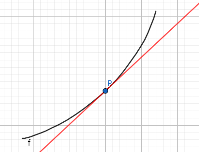
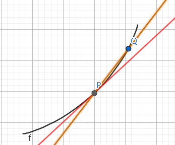
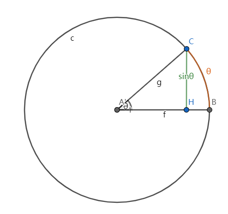
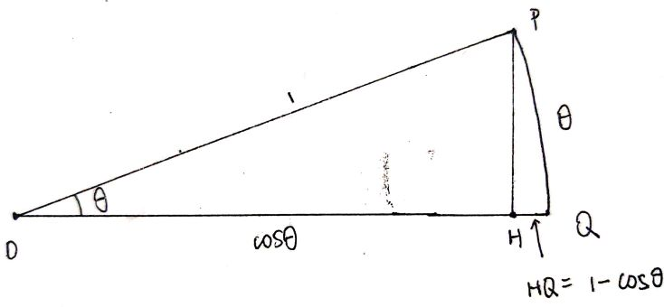
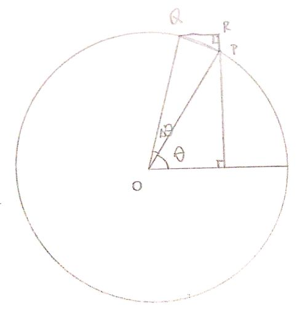
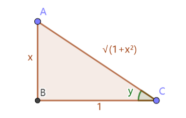
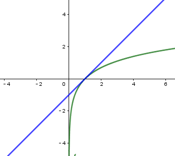
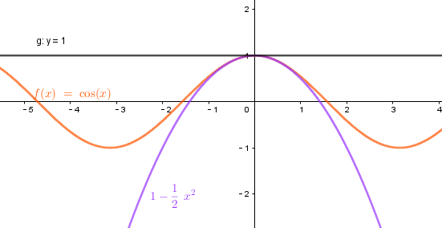

# MIT 18.01

# UNIT 1 DIFFERENTIATION

## INTERPRETATION

### GEOM INTERPRETATION

FIND THE TANGENT LINE To $y=f(x)$ at $P=(x_0,y_0)$:

$y-y_0=m(x-x_0)$

Point $y=f(x_0)$

Slope $m=f'(x_0)$

DEFIN $f'(x_0)$, the derivative of $f$ at  $x_0$, is the slope of the tangent line to $y = f(x)$ at P.

 

TANGENT LINE = LIMIT OF SECANT LINES PQ AS Q $\rightarrow$ P (P fixed) 
$\Delta x=x_q-x_p$, $\Delta f$

slope of the secant PQ  = $\frac{\Delta f}{\Delta x}$

$m = \underset {\Delta x \to 0}{\lim}\frac{\Delta f}{\Delta x}$

in more specific

$f'(x_0)= \underset {\Delta x \to 0}{\lim} \frac{f(x_0+\Delta x)-f(x_0)}{\Delta x}$

#### Example 1

$f(x)= \frac {1}{x}$,$P=(x_0,y_0)$

$\frac {\Delta f}{\Delta x}= \frac {\frac{1}{x_0+\Delta x}-{\frac {1}{x_0}}}{\Delta x}$

$=\frac 1{\Delta x}(\frac {x_0-(x_0+\Delta x)}{(x_0+\Delta x)x_0})$

$= - \frac 1{(x_0+\Delta x)x_0}$

$f'(x_0)= \underset {\Delta x \to 0}{\lim}- \frac 1{(x_0+\Delta x)x_0}=- \frac 1{x_0^2}$

#### Notations

$f'=\frac{df}{dx}=\frac{dy}{dx}=\frac{d}{dx}f=\frac{d}{dx}y$

#### Example 2

$f(x)=x^n, n=1,2,3 ...$

$\frac d{dx}x^n= ?$, $binomia\ theorem:(x+\Delta x)^n=(x+\Delta x)\cdots(x+\Delta x)\\ =x^n+nx^{n-1}\Delta x+O((\Delta x)^2)$

$\frac {\Delta f}{\Delta x}=\frac 1{\Delta x}((x+\Delta x)^n-x^n)  \\=\frac 1{\Delta x}(x^n+nx^{n-1}\Delta x+O((\Delta x^2))-x^n)\\=\frac{1}{\Delta x}(nx^{n-1}{\Delta x+O((\Delta x)^2))}\\ =nx^{n-1}+O(\Delta x)$

### RATE OF CHANGE

$\frac {\Delta y}{\Delta x} \underset {\underset {x\to0}{\lim}}{\to}\frac{dx}{dy} ,average\ change \to instantaneous\ rate$

### LIMITS + CONTINUITY

LEFT AND RIGHT LIMITS

$\underset{x \to x_0^+}{\lim},x>x_0$
$\underset{x \to x_0^-}{\lim},x<x_0$

#### CONTINUITY

DEF'N $f$ is continuous at $x_0$ means $\underset {x \to x_0}{\lim}f(x)=f(x_0)$

1. $\underset{x \to x_0}{\lim}f(x_0)\ exist\ Both\ L\ and\ R$
2. $f(x_0)\ is \ defined$
3. $\underset{x \to x_0}{\lim}f(x)=f(x_0)$

##### Type of discontinuity

###### Jump Discontinuity

$L,R\ exsit, L \neq R$，分段函数

###### Removable Discontinuity

$L,R\ exist ,L=R$
$\underset{x \to x_0}{\lim}\frac {\sin x}{x}=1$

$\underset{x \to x_0}{\lim}\frac {1-\cos x}{x}=0$
$f(x_0)\ is\ not\ defined,if\ defined\ ,the\ function\ is\ continuous$

###### Infinite Discontinuity

$y=\frac1x$
$\underset{x \to x_0^-}{\lim}\frac1x=-\infty$

$\underset{x \to x_0^+}{\lim}\frac1x=+\infty$

奇函数求导得偶函数

###### Other Discontinuity

$\underset{x \to x_0}{\lim}y=\sin\frac1x$$No\ L\ or\ R\ Limits,$ 在零反复震荡

#### Derivative=Continuity

Proof
$\underset{x \to x_0}{\lim}f(x)-f(x_0)=0\\\underset{x \to x_0}{\lim}\frac{f(x)-f(x_0)}{x-x_0}(x-x_0)=f'(x)\cdot0=0$

## DERIVATIVE FORMULAS

### TRIG FUNCTION

使用正余弦和角公式以及，$(\frac{\cos  x-1}{x})\prime=0$,$(\frac{\sin x}{x})\prime=1$

$(\sin x)\prime=\underset{\Delta x \to 0}{\lim}\frac{\sin (x+\Delta x)-\sin x}{\Delta x}\\=\underset{\Delta x \to 0}{\lim}\sin x \frac{(\cos \Delta x-1)}{\Delta x}+\cos x \frac{\sin\Delta x}{\Delta x}\\=\cos x$

在上下均为0的情况，必须通过转换使得上下也为0，不能出现1/0，不然就无法操作。

$(\cos x)\prime=\underset{\Delta x \to 0}{\lim}\frac{\cos (x+\Delta x)-\cos x}{\Delta x}\\=\frac{\cos x \cos \Delta x-\sin x \sin \Delta x-\cos x}{\Delta x}\\=-\frac {\cos x (1- \cos \Delta x)}{\Delta x}-\frac {\sin x\sin \Delta x}{\Delta x}\\=-\sin x$

#### Remarks

$\frac d{dx}\cos x |_{x=0}\underset{\Delta x \to 0}{\lim}\frac{\cos \Delta x-1}{\Delta x}=0$
$\frac d{dx}\sin x |_{x=0}\underset{\Delta x \to 0}{\lim}\frac{\sin \Delta x}{\Delta x}=1$

从一个点$x=0$可以得出整个函数的导数

#### Geometic proof of $(\frac{\cos  x-1}{x})\prime=0$,$(\frac{\sin x}{x})\prime=1$ and $(\sin x)\prime=\cos x$

##### $\frac{\sin x}{x}=0$

当$\theta \to 0,\sin \theta = \theta,\frac{\sin x}{x}=0$

#### $\frac{\cos x-1}{x}=0$

$\frac{\cos x-1}{x}=-\frac{1-\cos x}{x}=0$,length is positive

当$\theta \to 0,可以认为顶点O无限远离,1-\cos \theta = 0,much \ smaller\ than\ \theta,\frac{\sin x}{x}=0$

#### $\sin x$

$y=\sin \theta$

$RP=\Delta y=\sin \Delta \theta$
$\because \ang OP =\ang QRP\approx \ang QPO=90°\\\therefore\ang QPR=\theta\\\because QP\approx\Delta \theta\\\therefore\Delta y=\cos \theta \cdot \Delta \theta$

$\frac {d}{dx}\sin x=\underset{\Delta \theta \to 0}{\lim}\frac {\sin x}{x}=\underset{\Delta \theta \to 0}{\lim} \frac {\Delta y}{\Delta \theta}=\cos \theta$

#### $\sec x $

$\frac x{dx}\sec x=\frac d{dx}(\cos x)^{-1}=-(\cos x)^{-2}(-\sin x)=\tan x \sec x $

### Rules of Differentiation

#### General Rules

1. $(cu)\prime=cu\prime$
2. $(u+v)\prime=u\prime+v\prime$
3. $(uv)\prime=u\prime v+uv\prime$
5. Higher Derivative

#### Proof

$(uv)\prime=u\prime v+uv\prime$

$=u(x+\Delta x)v(x+\Delta x)-u(x)v(x)\\=[u(x+\Delta x)-u(x)]v(x+\Delta x)+u(x)[v(x+\Delta x)-v(x)]\\=\Delta u\cdot v(x+\Delta x)+u(x)\Delta v\\$
$\underset{\Delta x \to 0}{\lim}$
$=\frac {\Delta (uv)}{\Delta x}\\=\frac{\Delta u}{\Delta x}v(x+\Delta x)+u(x)\Delta x\  \because v(x) \ is \ continuity\ \therefore v(x+\Delta x)=v(x)\\=u\prime v+uv\prime$

$(\frac uv)\prime=\frac {u\prime v-uv\prime}{v^2}\\\Delta (\frac uv)=\frac{u+\Delta u}{v+\Delta v}-\frac uv\\=\frac {\Delta u v+uv-\Delta vu-uv}{(\Delta v+v)v}\\=\frac{\Delta uv-\Delta vu}{(\Delta v+v)v}\\=\frac {u\prime v-v\prime u}{v^2}$

Example $(\frac 1v)\prime=-v^{-2}v\prime$

### Chain rules $\frac {dy}{dt}=\frac {dy}{dx}\cdot \frac{dx}{dt}$

#### Implicit Differentiation

#### Example

$\frac {d}{dx}y=x^{\frac mn}\\y^n=x^m\\\frac{d}{dx}y^n=\frac{d}{dx}x^m\\ny^{n-1}y\prime =mx^m-1\\y\prime =\frac {mx^{m-1}}{ny^{n-1}},plug \ in\ y=x^{\frac mn}\\ y\prime=\frac mn x^{\frac mn-1}$

$x^2+y^2=1$

|                           explicit                           |                           implicit                           |
| :----------------------------------------------------------: | :----------------------------------------------------------: |
| $y^2=1-x^2\\y=\pm\sqrt{1-x^2}\\consider\ the\ positive\ part\\=(1-x^2)^\frac 12\\=-\frac {x}{\sqrt{1-x^2}}$ | $y^2=1-x^2\\\frac{d}{dx}y^2=\frac{d}{dx}(1-x^2)\\2yy\prime=-2x\\y\prime =-\frac {x}{y}$ |

$y^4+xy^2-2=0$

|                 explicit                 |                           implicit                           |
| :--------------------------------------: | :----------------------------------------------------------: |
| $y=\pm\sqrt\frac {-x\pm\sqrt{x^2+8}}{2}$ | $\frac {d}{dx}(y^4+xy^2-2=0)\\4y^3y\prime +y^2+2xyy\prime=0\\y\prime=-\frac{y}{4y^2+2x}$ |

### Inverse Function

implicit diff allows us to find the derivative of any inverse f'n,provided we know the derivative of the function

#### The picture of the inverse function.

exchange the  x, y axis,关于y=x对称。

#### Example

$y=\tan^{-1}x\\taking\ the\ tangent\ of\ both\ sides\\\tan y=x\\\frac{1}{\cos^2y}y\prime=1\\y\prime=\cos^2y$

$\to \cos y=\frac{1}{\sqrt{1+x^2}}$

$y\prime=\frac{1}{1+x^2}$

$y=sin^{-1}x\\taking\ the\ sin\ of\ both\ sides\\\sin y=x\\\cos y\cdot y\prime=1\\ y\prime=\frac{1}{\cos y}=\frac 1{1-\sin^2y}=\frac1{1-x^2}$

caution with range of function, draw a picture to make sure.

### EXPONENTIAL+LOGARITHMS

#### EXPONENTIAL

$a>0,a^0=1,a^1=a,a^2=a\cdot a\\a^{x^1+x^2}=a^{x^1}\cdot a^{x^2}\\(a^{x^1})^{x^2}=a^{x^1x^2} \\a^{\frac mn}=\sqrt[n] a^m$

$\frac {d}{dx}a^x\\=\underset {\Delta x \to 0}{\lim}\frac{a^{x+\Delta x}-a^x}{\Delta x}\\=a^x\underset{\Delta x \to 0}{\lim}\frac{a^{\Delta x}-1}{\Delta x}$

令$M(a)=\underset{\Delta x \to 0}{\lim}\frac{a^{\Delta x}-1}{\Delta x}$
$(a^x)\prime=M(a)\cdot a^x$
$\frac {d}{dx}a^x|_{x=0}=M(a)\cdot a^0=M(a)$
$M(a)$ is the slope of $a^x$ at x=0

##### **What is M(a)?**

**Beg the question(假设)**
Define base $e$ as the  unique number so that $M(e)=1$

$\frac d{dx}e^x=e^x\\\frac d{dx}e^x|_{x=0}=1$

##### Why $e$ exsit?

$f(x)=2^x,f\prime(x)=M(2)\\stretch\ by\ k\\f(kx)=2^{kx}=(2^k)^x=b^x\\b=2^k\\\frac d{dx}b^x=\frac d{dx}f(kx)=kf\prime(kx)\\\frac d{dx}b^x|_{x=0}=kf\prime(0)=kM(2)\\b=e\ when\ k=\frac 1{M(2)}$

即对于任意$a$都可以通过转换使得$b=e$

#### LOG

##### Natural Log

$w=\ln x\\y=e^x\Leftrightarrow\ln y=x\\\ln(x_1\cdot x_2)=\ln x_1+\ln x_2\\\ln 1=0 ,\ln e=1$

$w=\ln x\\e^w=e^{\ln x}\\e^w=x\\\frac d{dw}e^w\cdot \frac d{dx}w=1\\e^w\cdot \frac d{dx}w=1\\\frac d{dx}w=\frac 1{e^w}=\frac 1x$

$(\ln x)\prime=\frac 1x$

##### To differentiate any exponential

###### 1 USE base $e$

$a^x=(e^{\ln a})^x=e^{x\ln a}\\\frac d{dx}a^x=\frac d{dx}e^{x\ln a }=\ln a\cdot e^{\ln a\cdot x}=\ln a\cdot a^x\\M(a)=\ln a$

###### 2 Logarithmic differentiation

$\frac d{dx}u=??\\\frac d{dx}\ln u=\frac {u\prime}{u}$

###### EX1

$\frac d{dx}a^x,u=a^x\\\frac d{dx}\ln a^x=\frac d{dx}x \ln a=\ln a\\\frac {u\prime}u=\ln a\\u\prime = a^x\cdot \ln a $

###### EX2 moving exponential

$\frac d{dx}x^x\\\frac d{dx}x\ln x=\ln x+1\\\frac d{dx}x^x=x^x(\ln x+1)$

###### EX3

$\underset {n \to \infin}{\lim}(1+\frac 1n)^n\\\ln(1+\frac 1n)^n=n \ln (1+\frac 1n)\\=\underset{\frac 1n \to 0}{\lim} \frac {\ln(1+\frac 1n)-\ln 1}{\frac 1n}=\frac d{dx}\ln x |_{x=1}=\frac 11=1\\\underset {n \to \infin}{\lim}(1+\frac 1n)^n=e^1=e$

$\frac {d}{dx}x^r\\$,can use 2 methods above to prove.

$\frac d{dx}x^r$

1. use base e
   $e^{\ln x^r}\\=(e^{r\ln x})\prime\\=e^{r\ln x}\cdot \frac rx\\=rx^{r-1}$

2. use ln

   $u=x^r$
   $(\ln x^r)\prime=(r\ln x)\prime=\frac rx=\frac {u\prime}{u}$
   $\therefore u\prime =\frac rx \cdot x^r=rx^{r-1}$

##### Natural Log is natureal.

Example economics.

FTSE 100 $\downarrow$ 27.9,stocks 

$\frac {\Delta p}{p}=\frac {27.9}{6437}=.43\%$,when it comes to a minima time,$\frac {p\prime}{p}=(\ln p)\prime$,if use another base,the formular will be $\ln 10 \frac {p\prime}{p}=(\log p)\prime$

# UNIT 2 APPLICATIONS OF DIFFERENTIATION

## LINEAR APPROXIATIONS：

$f(x)\approx f(x_0)+f\prime (x_0)(x-x_0)$

### Explain 1

when $x \to x_0$,curve line is approximately the tangent line.

#### Example 1

$f(x)=\ln x,f\prime(x)=\frac 1x\\x_0=1,f(1)=0,f\prime(1)=1\\\ln x\approx 0+1\cdot(x-1)=x-1$

only when $x\approx 1$

### Explain 2

$\underset{\Delta x \to 0}{\lim}\frac{\Delta f}{\Delta x}=f\prime(x)\\\frac{\Delta f}{\Delta x}\approx f\prime(x)\Leftrightarrow\Delta f\approx f\prime(x)\Delta x\\\Leftrightarrow f(x)-f(x_0)\approx f\prime(x)(x-x_0)\\\Leftrightarrow f(x)\approx f(x_0)+f\prime(x)(x-x_0)$

$x_0=0\\\sin x\approx x\\\cos x \approx 1\\e^x \approx x+1\\\ln (x+1)\approx x\\ (1+x)^r \approx rx+1$

#### Example 2

$\ln 1.1\approx \frac{1}{10}\\\ln(x+1)\approx x $

this is the usage of linear approximation,simplify questions.

#### Example 3

Find linear approximation near x=0 of $\frac {e^{-3}}{\sqrt(1+x)}$

$=e^{-3x}(1+x)^{-\frac 12}\\\approx (-3x+1)\cdot(-\frac 12x+1)\\=1-3x-\frac 12x+\frac 32x^2\\\approx 1-\frac 72x$

my way

$\approx e^{-3x}e^{-\frac 12x}=e^{-\frac 72x}\approx 1-\frac 72x$

## QUARATIC APPROXIMATION

$f(x)=f(x_0)+f\prime(x)(x-x_0)+\frac {f\prime\prime(x_0)}{2}(x-x_0)^2$

#### Example 1

$\ln (1+x) \approx x-\frac{x^2}{2}$

$\ln 1.1=\frac 1{10}-\frac 1{200}=0.095$

$x \approx 0$

$\sin x \approx x\\\cos x \approx 1-\frac 12 x^2\\e^x \approx 1+x+\frac 12 x^2$

### Geomatic significance

