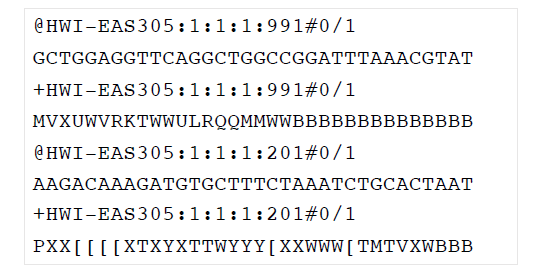
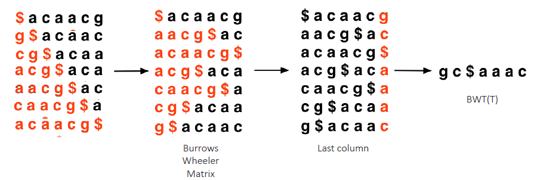
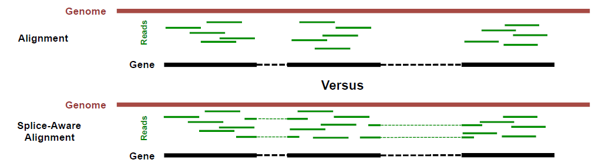
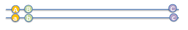

# STAT115

# High Throughput Sequencing and Read Mapping

## Sequence technologies

* $1^{st}$Generation Sanger
* $2^{nd}$ Generation illumina
* $3^{rd}$ Generation

## Fastaq AND FASTQC

### FASTQ File

#### Format

1. Seuqence ID
2. Sequence
3. Quality ID
4. Quality score
   * Phred quality
     * ASCII of sequence quality +33
     * -10 $\log_{10}$ Prob(bp is wrongly sequence)

### Why Quality Control?

* Sequencer output:
	*  Sequence “reads” + quality = FASTQ file.
* Is the quality of my sequenced data OK?
* What can I do if the quality is not good?
	* Read, a little reads is bad,just ignore
	* Sample, reprepare sample
	* Run, illumia should rerun for you
* Problem: FASTQ are massive files!
* Common tool: FASTQC.
	* http://www.bioinformatics.babraham.ac.uk/projects/fastqc/

### FASTQC

the bigger the better, 30 is ok

## Global Sequence Alignment & Needleman-Wunsch

### Why align the sequences?

the most efficent way to find the functional Relationship,Structural Relationship,Evolutinary Relationship.

### initialization step

### Matrix Filling

* Value from LEFT -2+(-2)GAP=-4
* Value from UP -2+(-2)GAP=-4
* Value from DIAGONAL 0+1(A=A Match)=1
* take the maximum number

### Trace back

* start at right bottom
* if matched go to diagonal
* if not matched go to the highest number

* only consider the arrow not the value.
* diagonal arrow: 
  * 1. larger to smaller$\to$match. 
    2. smaller to larger or equ $\to$ mismatch

* up or horizontal arrow: gap                       

## Local Sequence Alignment & Smith waterman

basiclly same with，but when finish a compute make negative value to 0.

trace back is simply form big to small

## Sequence mapping algorithms

map the Sequence to the genome

* Mapping hundreds of millions of reads back to the reference genome is CPU and RAM intensive and slow
* allow ~2 mismatch within first 30bp($4^{28}$ still uniquely identify) is slower and when allowing indels is further slower.

### Algorithms

#### Seed

* Break DB sequences into k-mer words (seed) and hash their locations to speed later searches.

#### BLAST Algorithm Steps

* For each k-mer in query, find possible DB k-mers that matches well with it.
* Only words with$\ge$T cutoff score are kept.
* For each DB sequence with a high scoring word, try to extend it in both ends.
* Form HSP (High-scoring Segment Pairs).
*  Keep only statistically significant HSPs.
* Based on the scores of aligning 2 random seqs.
* Use Smith-Waterman* algorithm to join the HSPs and get optimal alignment.

#### Suffix Tree

* A tree of all the suffixes of the reference	
	* “BANANA” has suffixes: BANANA, ANANA, NANA, … , A
*  Used in alignment tools such as MUMmer (Delcher et al, NAR 1999)

#### Suffix Array

used in RNA sequence

#### Borrows-Wheeler transformation & LF mapping.

Burrows-Wheeler Aligners

* [bwa](http://bio-bwa.sourceforge.net/)
* [bowtie](http://bowtiebio.sourceforge.net/bowtie2/index.shtml)

##### Burrows-Wheeler Transform

* Reversible permutation used originally in compression.
*  Database sequence T = acaacg$

every time move the last letter to the beginning

RANK rows $>A>C>G>T

get the last column and Store

##### Why BWT is useful for compression?

* Once BWT(T) is built, everything else is discarded
* First column BWM can be derived by sorting BWT(T)
* Characters will tend to cluster together
	* gc\$aaac$\to$gc\$3ac

#### BWT: LF Mapping

$1st$ g in last column is the $1st$ g is the first column

$2nd$ c in the last column is the $2nd$ c in the first column

add the letter in the last column to Final T

* if range becomes empty means it is no match
* If no match, instead of giving up, try to “backtrack” to a previous position and try a different base (mismatch, much slower).

trace back to find the position

in real,some of rows will have index(chr 1 203902),when find the match you can quickly get position.

## Alignment output: SAM and BED

### SAM File - Header

### Mapped Seq Files in SAM format

* Read name
* Map: 0 OK, 4 unmapped, 16 mapped reverse strand
* Sequence, quality score, XA (mapper-specific)
* MD: mismatch info: 3 match, then C ref, 30 match, then T ref, 3 match
* NM: number of mismatch
* BAM: binary compressed SAM format.

### BED & BigBED Files

* Rarely used to store full alignments: usually stores other types of genomic intervals.

# RNA-Seq

protein abundance can show the status of cell and organ, but methods to detect the protein abundance especially in genome wide is quiet limited.

RNA expression approximate the gene expression in the genome.

## Transciption and Splicing

## RNA-Seq Protocol

## RNA-seq Applications

* Examine the expression of all the genes in specific conditions (developmental stages, different tissues, normal vs disease, drug
  treatment, gene perturbation)
*  Find novel genes or transcripts
*  Model alternative splicing
*  Find gene mutations or gene fusions
*  Do not have to know the genome sequence or predict genes
*  Digital representation of gene expression
*  Good detection range (>105) from low to high expression level

## RNA Quality Control

* Degraded RNA are hard to be made into a sequencing library
	* From archival tissues or due to long storage
	* Shorter RNA, 3’ more stable
* DV200 is important for RNA QC
	*  RNA > 200 nt
	*  DV200 > 30% is recommended

## Experimental Design

* Ribo-minus (remove too abundant r/tRNA transcripts)
* PolyA (mRNA after splicing, enrich for exons, no tRNA/rRNA, most popular)
* Strand specific (directionality of RNA, useful for novel lncRNA)
* Sequencing: what does $200 / sample mean?
	* SE or PE: PE getting more popular
	* Depth: 20-50M for differential expression, deeper for transcript assembly orsplicing
	* Read length: longer for transcript assembly, splicing, or mutation calls
* Assessing biological variation requires replicates:
	* Technical (rarely used): same RNA, library prep and sequencing separately
	* Bio1: Cells grown in different dishes, processed on different days
	* Bio2: Cells / tissues from different lab animals (genetically identical, similarage and lifestyle)
	* Bio3: Cells / tissues from different human individuals
* How many replicates are good enough:
	* 1 only for exploratory assays, not good for publications
	* >= 2 OK for cell line samples
	* >= 3 preferred for animal samples
	* More for human samples
	
## RNA-seq Alignment and QC
### Alignment
* BWA?
	* can't map sequences across gap 
* Prefer splice-aware aligners(TopHat (BW), HISAT (BW), STAR (Suffix Array)…
* 

### Splice Aware Alignment
* Need genome index file

* Transcript annotation file is optional but not required

* Map to exons first

  

* Create junction database

* Map unmapped reads to junctions

  

* For longer reads, map shortersegments (~25bp)

## DESeq2

### 2 problems in library normalization  

#### Adjusting for differences in library sizes

 The difference is due to sequencing depth.

#### Adjusting for differences in library composition

maybe different tissue or knock some genes.

### Library normalization

|        | Sample #1 | Sample #2 | Sample #3 |
| :----: | :-------: | :-------: | :-------: |
| gene 1 |     0     |    10     |     4     |
| gene 2 |     2     |     6     |    12     |
| gene 3 |    33     |    55     |    200    |

1. take $\ln$ 

  |        | Sample #1 | Sample #2 | Sample #3 |
  | :----: | :-------: | :-------: | :-------: |
  | gene 1 |     -inf     |    2.3     |     1.4     |
  | gene 2 |     0.7     |     1.8     |    2.5     |
  | gene 3 |    3.5     |    4.0     |    5.3    |

2. Average Each Row

   |        | Average of log values |
   | :----: | :-------------------: |
   | gene 1 |         -Inf          |
   | gene 2 |          1.7          |
   | gene 3 |          4.3          |

3. Filter Out Genes with Infinity

   |        | Average of log values |
   | :----: | :-------------------: |
   | gene 2 |          1.7          |
   | gene 3 |          4.3          |

   this step filters out genes with zero read counts in one or more samples.lf you are comparing liver and spleen, thiswill remove all of the genes only transcribedin liver (or spleen).

   In theory, this helps focus the scaling factors on the house keeping genes - genes transcribed at similar levels regardless of tissue type.

4. Subtract the average log value from the log(conuts)

   |        | Sample #1 | Sample #2 | Sample #3 |
   | :----: | :-------: | :-------: | :-------: |
   | gene 2 |   -1.0    |    0.1    |    0.5    |
   | gene 3 |   -0.8    |   -0.3    |    1.3    |

   $=\ln{\frac{reads\ for\ gene\ X}{average\ for\ gene\ X}}$​,So this step is checking out the ration of the reads in each sample to the average across all samples. 

5.  Calculate the median of the ratios for each sample

   |        | Sample #1 | Sample #2 | Sample #3 |
   | :----: | :-------: | --------- | :-------: |
   | median |   -0.9    | -0.1      |    0.9    |

   Using the median is another way to avoid extreme genes from swaying the value too much in one direction.
   Genes with huge differences inexpression have no more influenceon the median than genes withminor differences.
   Since genes with huge differenceswill most likely be rare, the effect is to give more influence to moderate differences and"house-keeping" genes.

6. get scaling factor
|                |   Sample #1    |   Sample #2    |   Sample #3   |
| :------------: | :------------: | :------------: | :-----------: |
| scaling factor | $e^{-0.9}=0.4$ | $e^{-0.1}=0.7$​ | $e^{0.9}=2.5$​​ |

7. Divide the original read counts by the scaling factors
|        | Sample #1 | Sample #2 | Sample #3 |
| :----: | :-------: | :-------: | :-------: |
| gene 1 |     0     |    14     |     2     |
| gene 2 |     5     |     9     |     5     |
| gene 3 |    83     |    79     |    80     |

Differential RNA-seq

# ChIP-Seq

# DNA Methylation

# Lec 15

## Method to investigate 3D genome organization

FISH

3C

HiC

HiC data matrix

# Lec18 GWAS

## Polymorpism

* Polymorpsim gene/sites with "common" variation
* Locus vs alleles
* Minor alleles frequency >= 1%, otherwises call rare variant.
* Single Nucleotide Polymorpism(common) copy number and deletion are  rarer
  * Come from DNA-replication mistake, individual germ line cell, then transmitted
  * ~90% of human genetic variation
* Adjacent SNPs might be linked

## SNP Characteristics

### Linkage Disequilibrium

* Hardy-Weinberg equilibrium
  * 
  * 

* Linkage Disequilibrium
  * AB and ab are bigger than normal HW-e
  * Because A B are linkaged.
  * alleles occur together more often than expected by chance -> two alleles are physically close on  the DNA
  * Haplotype block : a cluster of linked SNPs with strong LD, block boundaries reflect recombination hotspots.
  * 
  * Association studies using haplotype is more robust than using individual SNPs

* SNPs infulence individual decisions on life styles, prevention, screening, and treatment.

## Two major Association Studies

### Family-based Association Studies

Look at allele transmission in unrelated families and one affected child in each

TDT: Transmission Disequilibrium Test

* Only heterozygote parents matters, calculate observed over expected
  * $\chi ^2 = \frac{(b-c)^2}{b+c}$
  * $Z^2_{TDT}=\frac{(9-2)^2}{9+2}, Z^2_{ZDT}$~$\chi^2,1df$
* Could also compare allele frequency between affected vs unaffected children in the same family

### Case Control Studies

Familiy Gene data is often difficult to get.

* SNP/haplotype marker frequency in sample of affected cases compared to that in age /sex /population-matched sample of unaffected controls
