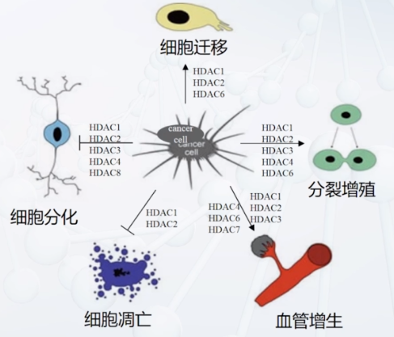
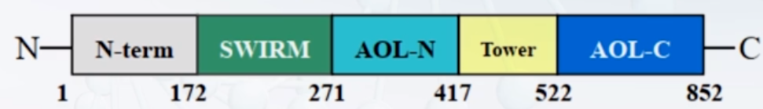

# 表观遗传学mooc

# 绪论

## 表观遗传学现象、概念、机制简介

### 现代表观遗传学的概念

不需要DNA序列变异的**可遗传**的基因表达的改变

### 表观遗传变异是如何实现的

表观遗传变异是通过对染色质（DNA和组蛋白）的共价化学修饰而实现的。这些组合式的染色质共价修饰也被称为：表观遗传密码。

* DNA甲基化
* 组蛋白修饰
* 染色质重塑与组蛋白辩题
* Small RNAs
* Prion and others
  表观遗传变异主要是染色质状态的变化大多是可逆的。
  不同表观遗传机制通常互为因果，“协同作用”
  表观遗传通常影响基因的表达
  一个关键的调控表观遗传基因的变异可以导致大规模表观遗传变异（遗传变异是表观遗传变异的源头，也有相反，也有独立。）
  生物的性状是二者共同决定

### 表观遗传学与进化简介

柳穿鱼*Lcyc*基因启动子区DNA甲基化变异导致花型和对称性改变，可能引起传粉者改变，随时间可能导致物种形成。
拟南芥HISN6B表观遗传沉默，HISN6A突变不具备功能，杂交导致F2致死，形成生殖隔离。
澳大利亚尤金袋鼠系杂交成种，其发生全基因组大规模DNA甲基化丢失，导致转座子转座激活，大量插入着丝粒区域，导致染色体形态异常，进而与亲本种交配减数分裂染色体异常配对，产生生殖隔离。

### 表观遗传学与人体健康简介

同卵双胞胎穗年龄增长即使同一环境也差异越来越大
母亲饮食通过改变DNA甲基化而影响后代健康
祖父的饮食状况可以通过表观遗传影响到孙代健康
组蛋白和DNA甲基化都能遗传

### 表观遗传学与作物改良简介

玉米驯化初期，tb1基因表观变异使得玉米具有顶端优势。
表观遗传是杂种优势的重要机理之一
表观遗传变异与光合效率有关，前者响应遗传变异。

# DNA甲基化

## DNA甲基化概述

DNA的核苷酸碱基甲基化修饰是目前发现的唯一的一种发生在DNA上的共价修饰形式
So far，三种甲基化类型，6mA,4mC,5mC.6mA和4mC主要存在原核生物和特定的真核生物。5mC是真核生物DNA表观遗传修饰的主要形式。
5mC是一种保守的表观遗传修饰，其在基因表达调控和维持基因组稳定上发挥重要作用，常被称为第5碱基，$C+SAM\stackrel{Dnmts}\longrightarrow5mC$
CD,CHG,CHH.
### 哺乳动物
哺乳动物基因组中胞嘧啶甲基化主要发生在CG，且70-80%CG位点都是甲基化，在卵细胞或神经细胞中存在CA甲基化。
哺乳动物这种全局基因甲基化的关键例外是**CpG岛**
CpG岛是富含CG的长度为500到1500bp的DNA序列，CG比例大于0.6,通常位于启动子区和5'结构域，大约60%的人类基因都有CpG岛。启动子区域的甲基化导致基因沉默
### 植物
植物的胞嘧啶甲基化发生在所有序列内容上：CG,CHG,CHH。但CG仍主要。
如拟南芥三者分别为24%，6.7%，1.7%。
玉米：基因组中大约65的序列都是转座子。大于25%的胞嘧啶是甲基化的。甲基化主要发生在异染色质区域，该区域富含转座子和DNA重复序列。可以看出甲基化是抑制转座子活性的重要机制。
### 真菌
仅重复序列的胞嘧啶是发生甲基化的。

## 哺乳动物中的DNA甲基化和去甲基化
### DNA甲基化酶的分类
甲基化残基：M4C,M6A,M5C
甲基化活性：从头甲基化，维持型甲基化
DNA甲基化状态：未甲基化，半甲基化和全甲基化。

M6A和M4C甲基化酶主要负责维持A(6N),和C(N4)的甲基化，这两种酶首次发现是在原核生物中，具有双功能：
1. DNA未甲基化时，限制性内切酶的功能
2. DNA半甲基化，甲基化转移酶
M5C甲基转移酶负责C5的甲基化
### 甲基化的动态调节
**甲基化：**
从头合成甲基化
维持型DNA甲基化：DNA复制时，根据老链copy-paste
**去甲基化**：
被动去甲基化：维持型甲基化酶活性丢失或抑制，导致复制后新链未加上甲基化，最后导致甲基化消失
主动甲基化：主动去甲基化酶去甲基化

DNA CG甲基化是可以遗传的，即使敲除DNMTS酶去除甲基化，恢复后，也能恢复甲基化状态。说明有两种方式。而不是只有维持。

### 哺乳动物中的DNA甲基转移酶
N端为酶的调控部分包括与染色质和蛋白的互作结构域，C端为催化结构域
DNMT1：维持型
DNMT3A:从头甲基化
DNMT3B:从头甲基化
DNMT3C：仅存在于啮齿类
DNMT3L：不具有甲基转移酶活性，帮助3A,3B发挥作用
UHRF1：多结构域蛋白E3泛素蛋白连接酶，DNMT1发挥作用的必要辅助因子。

DNMT2只包含催化结构域，是RNA甲基化活性，是tRNA甲基转移酶
现在的研究表明
Dnmt1具有很大程度的从头合成甲基化酶的活性，而DNMT3具有一定的维持型DNA甲基化酶的活性。
**为何哺乳动物只有CG存在甲基化**
从头合成甲基化酶对所有C都有活性，但是，DNMT1与UHRF1协同作用导致维持作用只存在于CG，其他位点被动去甲基化导致哺乳动物中一般只有CG存在甲基化。

### DNA的去甲基化
5mC甲基化被认为是稳定的表观标志，DNA被动去甲基化被认为是在DNA复制过程中维持系统失活导致的被动去甲基化
主动去甲基化：不依赖于复制，主动去甲基化酶的作用
#### 主动去甲基化酶
有TET1,TET2,TET3
主动去甲基化过程:
1. TET酶将5mC氧化成5hmC,5fC，5caC
2. 5fC和5aC被TDG（Tdna 糖基化酶）识别并切除
3. 启动BER(碱基切除修复)途径，在切除位点上加上一个未甲基化的C

#### DNMTs和TET作用于靶位点的机制
甲基化酶和去甲基化酶可以竞争性的结合靶位点
1. 不同的染色质修饰能够招募或去除甲基化酶从而启动或去除甲基化
2. 一些蛋白质能够帮助甲基化酶或去甲基化酶作用于基因组位点
3. CG和非CG位点的修饰状态和侧翼序列影响甲基化酶和去甲基化酶活性
4. DNA甲基化或去甲基化标记可以沿着基因组位点进行延伸

#### CpGIs AND regulation of transcription

1. CGIs的染色质状态
   1. CGIs未甲基化，转录的位点具有组蛋白H3/H4ac和H3K4me3标记。RNAPII能够组成型结合在该位点，促成转录许可状态。
2. DNA甲基化抑制基因的表达：DNA甲基化与CGIs的稳定和长期的沉默相关
   1. MBD蛋白招募共抑制符合物HDAC去除组蛋白乙酰化
   2. DNA甲基化状态抑制转录因子的结合
3. PcG（ploycomb group protein）抑制基因表达：两种复合物PRC1和PRC2，一个未知的CGI-结合因子招募PRC2到CGIs，H3K27me3,这个标记被PRC1识别，抑制转录延伸，从而沉默基因表达。

#### 哺乳动物中CpG岛不被甲基化的机制
1. 甲基化阻断系统的作用
   1. 包含C-X-X-C的锌指结构域能够保护CGIs不被甲基化
   2. TET1酶能够催化5mC为5hC包含一个CXXC结构域能够定位于CGIs。
   3. 组蛋白修饰影响DNMT的活性：CFP1招募Set1复合物到CGIs，该复合物催化组蛋白H3K4me3，该位点的H3K4me3可以阻止从头甲基化酶到该位点从而抑制甲基化
2. 转录因子及转录本自身的作用
   1. RNAPII和/或转录因子占据了DNMT与CGIs的结合位点从而阻止DNA甲基化的发生。
   2. R-loop：在CGIs，作为模板的DNA链整体上C多余G,非模板G多于C，转录出的RNA与模板链DNA形成一个RNA：DNA杂合链与非模板链形成R-loop，该结构可阻止DNMT在该位点的结合从而阻止甲基化发生。
   3. 甲基化阻断系统与活跃转录的双重中断
      * CpG-free DNA靶向插入到CGIs，诱导人类胚胎干细胞的整个CGIs发生从头甲基化，当去除CpG-free DNA后，这种甲基化状态仍然可以稳定的维持
        * 说明甲基化阻断系统与转录活性的双重阻断对于维持CoGIs的未甲基化是必要的。

### 植物中的DNA甲基化和去甲基化
#### 植物中DNA4甲基化的建立
植物中的RdDM途径，植物特有，由sRNAs指导植物中所有序列内容的从头甲基化
1. 经典的RdDM
   1. sRNA的产生
   2. sRNA产生位点的靶向DNA甲基化

# 组蛋白修饰

## 组蛋白概述

**核小体**是染色质的基本结构单位。
**组蛋白**是组成核小体的基本成分。
核小体由组蛋白八聚体（两个包含H2A、H2B、H3和H4的八聚体组成）和缠绕在组蛋白的DNA组成。

### 组蛋白分类及性质

根据**氨基酸成分和相对分子质量**分为**H1、H2A、H2B、H3、H4**
后四种氨基酸序列相似，在核心组蛋白中绝大多数氨基酸与DNA或其他组蛋白相互作用，能够替换而不引起重大变异的氨基酸残基很少，而在所有生物中组蛋白与DNA相互作用的骨架都是一样的。

#### H1

* 与其他组蛋白不同，H1不参与核小体的组建，在构成核小体时起连接作用，并赋予染色质以极性。
* **H1**有一定的组织和种属特异性，在进化上相对不保守，不同生物的H1序列变化较大。

#### H2A

* **H2A**是组成核小体的重要单元
* **H2A**具有最多的变体类型、在调控染色质整体结构中发挥重要左右

#### H2B

* **H2B**是组成核小体的重要单元。

#### H3

* **H3**是组成核小体的重要单元。
* **H3**具有突出与核小体体外的长"尾"，能够在不同的地方进行共价修饰
* 尾巴的修饰对基因表达调控起着至关重要的作用

#### H4

* **H4**是组成核小体的重要单元
* **H4**可发生共价修饰，包括乙酰化和甲基化，调控基因表达。

###  组蛋白修饰

乙酰化， 甲基化， 磷酸化， 泛素化，其他：SUMO化、 糖基化。
通过特定的酶修饰或去除

#### 乙酰化

* 乙酰化是最早发现的影响转录调控组蛋白修饰之一。
* 乙酰化通常发生在**H3、H4**的N末端尾巴的赖氨酸上，是可逆的。包括乙酰化和去乙酰。
* 组蛋白主要靶向启动子区域激活基因，也称为启动子局部乙酰化，乙酰基所带的负电荷能够中和组蛋白所带的正电荷，降低组蛋白与DNA之间的亲和度，所以一定程度上认为乙酰化使染色质疏松激活表达。
* **打开染色质，起始转录；降低DNA和组蛋白之间的电荷作用；阻止染色质压缩；可能和甲基化发生在同一个残基上，竞争性拮抗，调控基因表达**（如H3K27位点的甲基化和乙酰化分别竞争调控位点的激活与抑制）
* 乙酰化修饰通常发生在
  * H2A:K5
  * H2B:K5,K12,K15,K20
  * H3:K4,K9,K14,K18,K23,K27,K36
  * H4:K5,K8,K12,K16

#### 组蛋白乙酰转移酶

* **GNAT超家族**
  * Gcn5，PCAF，Elp3，Hat1
* MYST超家族
  * MOZ，Ybf2/Sas3、Sas2和TIP60，与进化有关
* P300/CBP超家族
  * 有超过75个非组蛋白底物，与细胞分化和凋亡关系密切
* TAFII-250超家族
  * 核受体辅助激活无，如ARCR、SRC1等

##### GNAT家族和MYST家族

相同点：二者都含有乙酰辅酶A同源序列
不同点：核心区域存在差异

GNAT家族主要负责H3上K位点乙酰化
MYST家族与H4上K位点乙酰化有关

##### 组蛋白乙酰转移酶复合物

| 乙酰转移酶复合物 |          特点          |
| :--------------: | :--------------------: |
|       SAGA       |       大型复合物       |
|       ADA        |  不能与激活域相互作用  |
|       NuA4       |   主要乙酰化组蛋白H4   |
|       NuA3       |  不能与激活与相互作用  |
|    Gcn5/PCAF     | HeLa细胞的核提取物纯化 |
|      Tip60       | 不能乙酰化核小体组蛋白 |

#### 组蛋白去乙酰化酶

目前在人体中共发现18种去乙酰化酶。根据序列同源性，被分为四种类型。
第一类与酵母中RPD3序列同源性较高
第二类与酵母中HDA1
第三类与SirR 

#### 组蛋白去乙酰化酶抑制剂

组蛋白去乙酰化酶在肿瘤中高度表达

去乙酰化酶具有高效性和低细胞毒性

#### 组蛋白的乙酰化和去乙酰化

## 组蛋白修饰

### 组蛋白甲基化

组蛋白的甲基化是发生在精氨酸和赖氨酸的共价修饰作用
甲基化修饰通常发生在组蛋白H3:K4、9、27、36、79以及H4K20，可分为me1，me2，me3

通常认为
* H3K4、H3K36、H3K79甲基化修饰介导基于转录活化
* H3K4、H3K27、H3K20甲基化修饰介导基因转录抑制

精氨酸甲基化通常发生在组蛋白H3R2、R8、R17、R26以及H4R3，可分为me1，对称二甲基化，非对称二甲基化

| 组蛋白甲基化修饰 | 染色体常见分布 |    主要功能    |
| :--------------: | :------------: | :------------: |
|     H3K9me3      |  中心粒、端粒  | 组成型异染色质 |
|     H3K27me3     |    沉默基因    |    沉默基因    |
|     H3K4me3      |  转录起始位点  | 转录活性区标记 |
|     H3K36me3     |     转录区     | 转录活性区标记 |

#### 组蛋白甲基转移酶

##### 组蛋白精氨酸甲基转移酶（HRMTs)

根据催化精氨酸甲基化的产物可分为三类

* Ⅰ型催化形成单甲基R和非对二甲基R
* Ⅱ型催化形成单甲基R和对称二甲基R
* Ⅲ型催化形成单甲基R

组蛋白精氨酸甲基化修饰在基因转录中起重要作用，HRMTs与转录因子相互作用，被招募到启动子，通过对精氨酸的甲基化修饰发挥共激活因子的作用，参与转录调控。

##### 组蛋白赖氨酸甲基转移酶（HKMTs）

* SET结构域家族
  * SET结构域本身是一种新型的$\beta$折叠，其间插入了一个可变长度的模体，因此被分成N端和C端部分，插入的模体被称为iSET区域
  * 不同的SET结构域甲基化转移酶能催化单、双或三甲基化赖氨酸。
* 非SET结构域的DOT1家族
  * DOT1是首个被发现的无SET结构域组蛋白赖氨酸甲基转移酶。
  * DOT1结构包含N末端的α-螺旋结构域和C末端的催化结构域。
  * DOT1催化组蛋白H3第79位赖氨酸(H3K79)的甲基化，这是一种在真核生物的常染色质广泛发生的修饰。

#### 组蛋白去甲基化转移酶

##### LSD1

* 黄素腺嘌呤单核苷酸依赖性胺氧化酶，从酵母到人类均十分保守
* N端的SWIRM (Swi3p/Rsc8p/Moira)结构域，C端的胺氧化酶(Amine oxidase like,AOL)结构域，中心定位一个Tower结构域。
* 催化me1和me2的H3K4和H3K9去甲基化。
* LSD1调控着基因转录的激活和抑制在胚胎发育和肿瘤发生过程中发挥着重要的作用。

**LSD1对胚胎发育具有调节作用**
* 敲除果蝇胚胎中的LSD1，会引起组蛋白H3K4高度甲基化和基因表达异常，从而导致胚胎的死亡
* 在小鼠胚胎发育过程中的原肠胚形成需要LSD1
* 斑马鱼胚胎中神经细胞的发育与LSD1有关
* 拟南芥组蛋白去甲基化酶LSD1同源物FLD在开花诱导中起决定作用

**LSD1对肿瘤发生的调节作用**
* 人的前列腺癌细胞中，LSD1能够与雄激素受体结合，激活雄激素受体以来的基因表达，维持癌细胞永生化的特性。
* LSD1与神经母细胞瘤分化密切相关，可以抑制神经母细胞瘤的生长
* LSD1能阻断p53信号通路的传递，导致细胞增殖失控
* LSD1与水稻细胞程序性死亡有关

##### JmjC家族

含JmjC结构域，27位成员，催化me1，me2，me3去甲基化

### 组蛋白磷酸化

作用机理：
* 磷酸基团携带的负电荷中和了组蛋白上的正电荷，造成组蛋白与DNA之间亲和力下降。
* 修饰能够产生与蛋白质识别模块结合的表面，与特异性的蛋白质复合物相互作用。

组蛋白磷酸化可能会改变组蛋白与DNA结合的稳定性，在细胞信号传导、有丝分裂、细胞死亡、DNA损伤 修复、DNA复制、转录和重组过程中发挥重要作用。

### 组蛋白泛素化

* 组蛋白泛素化是组蛋白赖氨酸残基域与泛素分子羧基末端的互相结合，
* 所有组蛋白核心蛋白都可以被泛素化，但**H2A**，**H2B**是最常见的，是细胞核中泛素化程度最高的两种蛋白。
* 一般认为，H2AK119的泛素化和转录抑制相关。H2BK123泛素化与转录激活有关。
* 组蛋白泛素化在DNA损伤反应中起核心作用。

### 组蛋白SUMO化

SUMO化修饰过程包括活化、结合、连接、修饰等过程。
SUMO化修饰是一个动态可逆的过程。

### 相互作用
协同或拮抗共同发挥作用、调整染色质状态，调控基因表达。

* 组蛋白的乙酰化修饰对组蛋白的磷酸化具有促进作用。
* H2B泛素化修饰会增强H3K4的甲基化;也能增强Dot1介导的H3K79甲基化。

## 组蛋白变体

**核小体**是染色质的基本结构单位。研究表明，核小体已不是简单的“染色质上的珠子”而是染色质特殊化和动态的参与者。
组蛋白是组成核小体的基本成分。组蛋白的成分除了常规H2A、H2B、H3、H4和H1外，还包括其他的组蛋白变体，组蛋白的变体和修饰共同参与染色质表观遗传。

### 概念

组蛋白变体是相对于染色质中常规的组蛋白而言，为特殊状态的染色质所需的组蛋白的类型，染色质的构型依赖于组蛋白，不同的组蛋白变体能使染色质形成不同的构型。处于不同状态的染色质需要相应的组蛋白变体维持结构,以完成其生物学功能。组蛋白和对应变体的替换是细胞对特定的生理状态和所受的刺激的反应。

### 组蛋白变体

#### H1变体

H1变体的功能具有组织特异性和发育阶段的特异性。
H1有一小段N末端、一个高度保守的中心球体区域、一段长的C末端。

* H1a、 H1b、 H1c、H1d、H1e、H1.X存在于体细胞中。
* H1oo特异存在于卵细胞中，能抑制转录，含大量赖氨酸，是甲基化或乙酰化的潜在位点，利于染色质的凝缩抑制转录
* H1t、H1t2特异存在于精细胞中，其C端都加上了a螺旋，有助于精核染色质高度凝缩。
* H1变体通过调节与DNA的相互作用，直接影响核小体包装的松紧程度和染色体的高级结构
* 与核小体包装相关的H1变体的C端变化很大，影响其结合染色质的能力。

#### H2A变体

H2A变体是核心组蛋白中最不保守的，有大量的变体存在，其变体与核心组蛋白H2A的差异在于c末端尾部的长度和序列变化，还有它们在基因组中的分布。

* H2A.X的C端具有保守的SQE结构域，139位丝氨酸可发生磷酸化修饰，DNA断裂时会引|起H2A.X的磷酸化修饰，H2A.X 的高磷酸化修饰是细胞凋亡的特征之一， 对DNA损伤修复有重要作用。
* H2A.Z在进化上保守，广泛分布于真核生物的染色体中,组装在启动子附近区域，其功能主要是调节基因的转录。
* H2A.Bbd和常规的H2A只有48%是一致的， 比其他的H2A变体都短，尾部的缺失会使核小体变得不稳定，定位在活性x染色体和常染色体，标志着染色体的转录激活。

#### H2B变体

* H2B变体仅在精子中可以发现，人精子中的H2B的变体比体细胞中的H2B含有更多的精氨酸，并在N末端含有脯氨酸残基
* H2B的N端对染色质的凝缩有重要作用。H2BFWT和正常的H2B的同源性很低,它和H2B有最低的亲缘关系。

#### H3变体

H3变体包括着丝粒特异的CENPA变体、转录激活的核小体中的H3.3和精巢特异的H3t。

* CENPA (CenH3)** 是特异存在于着丝粒上的H3变体，在真核生物中高度保守，指导动粒蛋白结构的形成，调节真核细胞染色体的分离。
* 在活跃的核仁组织中，H3..3仅在转录活跃的核小体内替换H3, H3.3与H3仅有4个氨基酸残基不同。在果蝇中发现，H3.3倾向分布于多线染色体的转录活跃区域，具有**转录激活**的作用。

#### H4变体

H4变体是进化最慢的蛋白质之一，最近在人的脂肪细胞中发现了组蛋白H4变体，包括HIST2H4B和HIST1H4A-L/HIST2H4A-B/HIST4H4。
HIST2H4B-与经典的组蛋白H4仅在N末端有两个氨基酸的差异，HIST2H4B变体是缬氨酸和色氨酸，而H4组蛋白是丝氨酸和甘氨酸。

常规组蛋白的形成是在细胞周期的**S**期，而组蛋白变体往往在**整个细胞周期**都会表达，它的形成**不依赖于DNA复制**，可以通过复制非依赖性组装来替换常规组蛋白，切换染色质状态。
在基因组内，组蛋白变体有着和核心组蛋白具有明显不同的**生物物理学特征和分布模式**。

* 转录激活相关的组蛋白变体: H2A.Bbd、H3.3和H2A.Z。
* DNA损伤修复相关的组蛋白变体: H2A.X。
* 异染色质和染色体失活相关的组蛋白变体: CENPA、MacroH2A、H2A .X。

### 组蛋白变体替换

核小体是动态的，组蛋白的替换不仅包括常规的组蛋白与组蛋白变体之间的替换，还包括变体之间的替换和修饰状态不同的同种组蛋白之间的替换，这些过程是由相应的**染色质重构复合物**来替换的。

常规的组蛋白在S期复制叉后组装入核小体，组蛋白变体的组装独立于DNA复制之外
转录激活时，组蛋白替换由RNA聚合酶Ⅱ和染色质重构复合物协同完成。

|      组蛋白      |          组装复合物          |
| :--------------: | :--------------------------: |
| H2A、H2B、H3、H4 |             Caf1             |
|      H2A.Z       | SWR1、Nap1、RNA ploymerase Ⅱ |
|      H2A.X       |         INO80、Tip60         |
|     MacroH2A     |         HIRA、ASF1a          |
|      CENPA       |          Caf1、HIRA          |
|       H3.3       |             HIRA             |

* 
* SWR1可能导致DNA波动的产生，并限制在H2A，H2B结合区域。在已破坏的H2A DNA区域移去H2A、H2B二聚体将H2A.Z-H2B二聚体装入核小体，这种替换不需要核小体全面解开
* H3.3-H4替换H3-H4则同时需要H2A-H2B的移去再重新组装入核小体

# 染色质重塑

## 染色质重塑的概述

**染色质**是指间期细胞核内由DNA、组蛋白、非组蛋白及少量RNA组成的线性复合结构，是间期细胞遗传物质存在的形式。
**染色体**是指细胞在有丝分裂或减数分裂过程中，由染色质聚缩而成的棒状结构。

### 染色质的结构

#### 一级结构

核小体是由DNA和组蛋白形成的染色质基本结构单位。每个核小体由146bp的DNA左旋缠绕组蛋白八聚体1.75圈形成。核小体核心颗粒之间通过8-114bp左右的连接DNA相连。H1结合在盘绕在八聚体上的DNA双链开口处。

#### 二级结构

#### 高级结构

### 染色质的状态

常染色质
异染色质
常$\rightarrow$异或异$\rightarrow$常 称为**染色质重塑**
分子机理包括：DNA甲基化、组蛋白修饰、染色质重塑符合物的协同作用。

### 染色质的功能

* DNA装配
  2m的DNA能装配到一个直径只有2um的细胞核中转录调控(Transcription regulation)

* 转录调控

  在压缩松弛的常染色质区域，DNA易被蛋白质阅读并进行转录，异染色质区相反

* 帮助DNA修复
  染色质结构的高动态性，在DNA出现损伤的区域压缩变松，有助于DNA修复蛋白的靶定

### 染色质重塑

#### 概念

**染色质重塑**:
DNA的复制、转录和重组等过程中，染色质的包装状态、核小体中组蛋白以及对应DNA分子发生改变的生物学过程。染色质重塑是一个重要的表观遗传学机制。

涉及到两大因素控制染色质重塑的过程:

1. 组蛋白修饰因子 ;
2. ATP依赖的染色质重塑因子。

#### 组蛋白修饰因子

#### 动态的核小体

核小体异常动态。

1. 位置具有可塑性，能够顺着DNA滑动
2. 完全或部分解离
3. 可被翻译后修饰，其核心组蛋白可被其变体代替

均离不开ATP依赖的染色质重塑因子

## ATP依赖的染色质重塑复合物

### 染色质重塑模式

* 核小体在DNA上的滑动
* 从染色质上移除组蛋白八聚体
* 改变核小体间距
* 组蛋白变体与经典组蛋白间的置换

### ATP依赖的染色质重塑复合物

是依赖ATP水解产生的能量破坏DNA与组蛋白的相互作用,改变核小体的结构从而实现重塑功能的，其核心亚基是它的**ATP酶催化亚基**。

