# 机器学习-李宏毅

# Framework of ML

**Training data**:$\{(x^1,\hat{y}^1),(x^2,\hat{y}^2),\cdots ,(x^N,\hat{y}^N)\}$

**Training:**
1. *create network* $y=f_\theta(x)$
2. *define a loss fuction* $L(\theta)$
3. *optimizer* $\theta^*=arg\underset{\theta}{min}L$

Testing data:$\{x^{N+1},x^{N+2},\cdots ,x^{N+M}\}$

*Use* $y=f_{\theta^*}(x)$ *to label the testing data*

*Use proper method to evaluate the model*

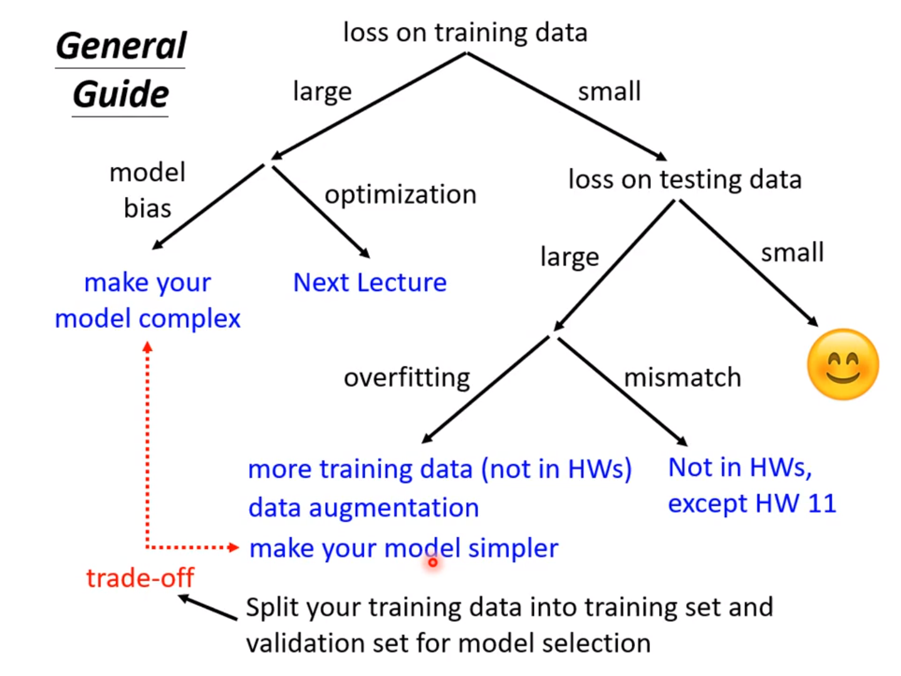

检查 Training data Loss
* if large 考虑 model bias， optimization
    * model bias
      * 模型太过简单，增加参数或深度，或换用更复杂的架构
    * optimization
      * 无法走到最小值
    * 如何判别二者
      * 当复杂模型$C$在测试集上的表现不如浅层模型$E$，比较其在训练集上的表现，若$C$表现还是不如$E$,可以得出问题出在Optimization
      * Train比较浅易于训练的model得到大概的loss，如果复杂model的表现在train data上不如浅的model则是Optimization的问题
* if small 查看 Loss on testing data
  * large， overfitting
      * 增加训练资料
      * Data augmentation
      * 增加模型限制
          * 减少参数，共享参数
          * 更少的Features
          * Early stopping
          * Regularization
          * Dropout
  * mismatch, 训练资料和测试资料分布不同

# Self-Attention

## Sophisticated Input

* Vectors Set
* may change length

## Vector Set as Input

### sentence

输入的句子就是一个长度不同的向量组
如何将单词表示向量

  1. One-Hot，缺点假设各单词毫无关联
  2. word Embedding， 将语义相似的词汇分成一类给与向量

### 语音

 frame

* 400 sample points
* 39-dim MFCC
* 80-dim filter bank output
  Window长25ms，步长10ms

### Graph

分子结构图

* One-Hot
  社交网络

## Output

### Each vector has a label

* POS tagging
* 音节辨识
* 社交网络（决定每一个节点的性质）

### Whole sequence has a label

* Sentiment analysis
* Speaker recognition
* molecular properties judgement

### Model decide the number of label itself

* Seq2Seq(语音辨识，机器翻译)

## Sequence Labeling

### Fully connected Network

将每一个word 当做单独的输入 put into Fully-connected Network： I saw a saw 无法判别 前后两Saw
改进，将前后向量一起丢入一个FC,及给FC一个window的资讯。局限性：window长度不变，若用最长的sequence当做window长度，可能会导致过拟合以及运算时间过长

### Self-attention

# GAN

## Generation

### Network as Generator

Generator ,x,加上一个Simple distribution（够简单知道公式），通过加，拼接等方法作为输入放入Network，输出一个Complex distribution。

### why distribution？

video prediction 游戏人物向左向右都可能，如果监督学习，会使得游戏人物分裂，因为向左向右都正确，减少loss network就会使得其分裂。

相同的输入具有不同的输出，让机器具有创造力。绘画？聊天机器人？合成生物学？

### GAN

gan的种类多的离谱

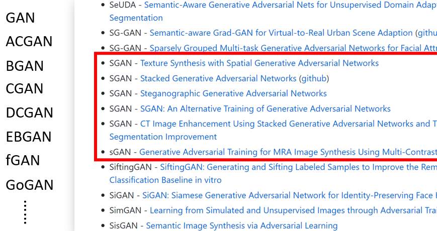

#### Anime Face Generation

Unconditional generation

没有x，z假设是从一个normal distribution中sample出来，通常是low-dim vector(dim自定，50,100?),将z输入后generator就会输出一个high-dim vector。
不同distribution没有很大的差异，generator会将简单的distribution 映射到复杂的distribution。

Discriminator 

值越大越是真实的二次元头像

$Generator$与$Discriminator$都由自己设计

### Basic Idea of GAN

物竞天择

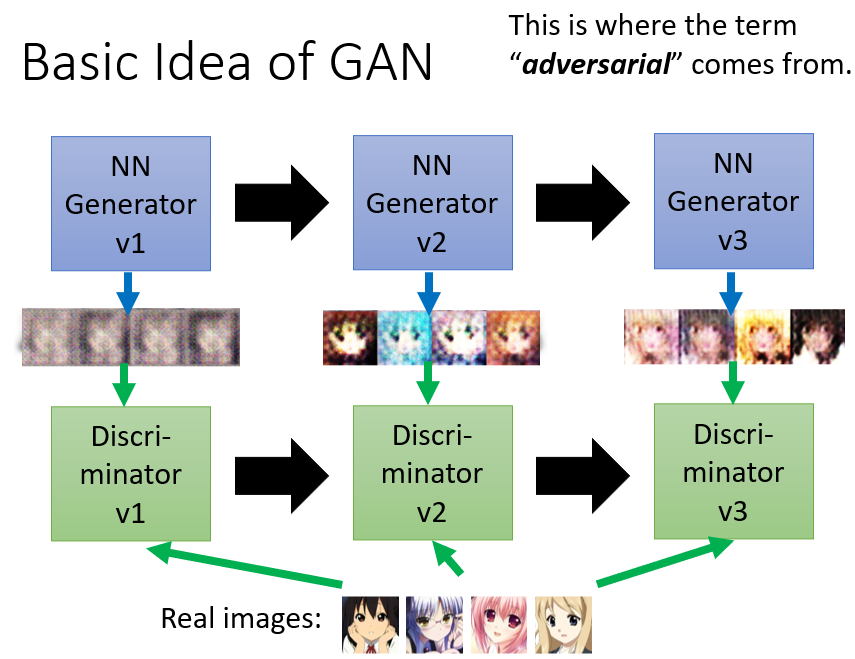

$Generator$产生的图片越来越真实，$Discriminator$判断的标准越来越严苛。

写作敌人，念作朋友。

### Algorithm

#### STEP1

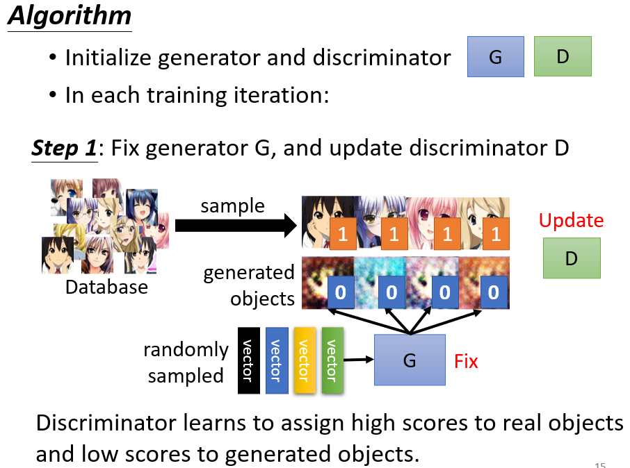

初始化G,D权重

固定G，使用随机sample Vector 扔入G，生成图片，将生成的图片标记为0，真实的图片标记为1，扔入D中，训练D（可以分类可以回归或其他由自己设计）。

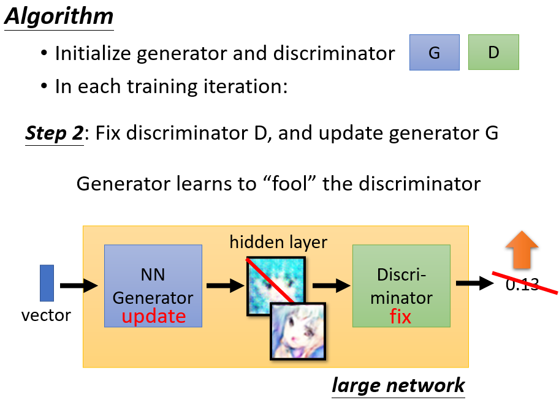

固定$Disciminator$权重，训练$Generator$，使得$Discriminator$的输出越大越好。

更具体的来说，将G与D拼成一个大的$Network$，中间有一隐藏层是G的输出，这个$Network$的输入越大越好。

之后反复训练。

## Theory behind GAN

在GNA中我们要最小化的就是$P_G,P_{data}$之间的$Divergence$。

Divergence（散度）可以简单的理解为两个分布之间的距离。

 找到$G^*$使得$Div(P_G,P_{data})$最小，类似$w^*,b^* = arg\underset{w,b}minL$

直接计算$Divergence$过于复杂，不现实。GAN只需要从$P_G,P_{data}$中Sample就能计算$Divergence$

Discriminator，对data sampled from​ $P_{data}$给高分，对从$P_G$给低分。即寻找$D^*$，最大化Objective Function $V(G,D)= E_{y\sim P_{data}}[logD(y)]+E_{y\sim P_G}[log(1-D(y))]$。

而最大化$V(G,D)$,本质就是cross entropy乘以负号 Binary分类问题中 最小化cross entropy。

而$\underset{D}maxV(D；G)$经过一番推导发现就与$JS$ $Divergence$有关

为何$\underset{D}maxV(D；G)$与$Divergence$有关？直观解释 

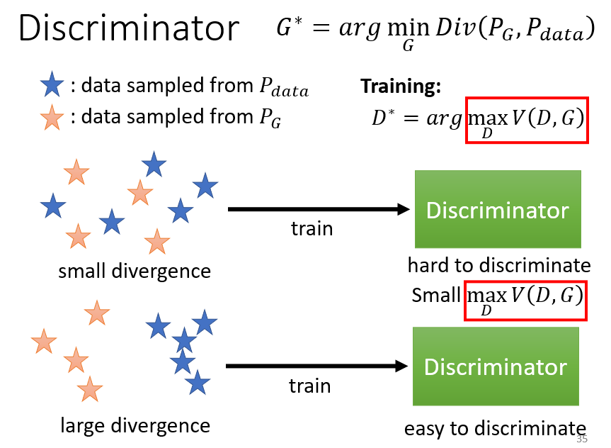

对于相似的分布(即$divergence$小)，$Discriminator$难以将其分开会得到一个较小的$\underset{D}maxV(D；G)$，对于不同的分布(即$divergence$大)，$Discriminator$容易将其分开得到一个较大的$\underset{D}maxV(D；G)$

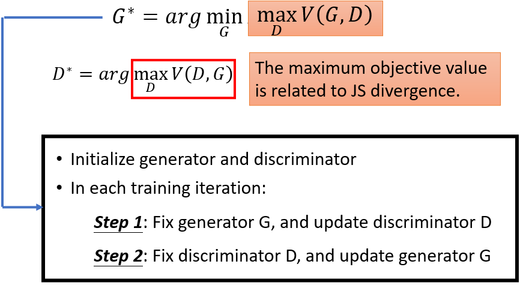

既然$\underset{D}maxV(D,G)$与JS$Div(P_G,P_{data})$有关联，直接用前者替换后者得到上述公式。

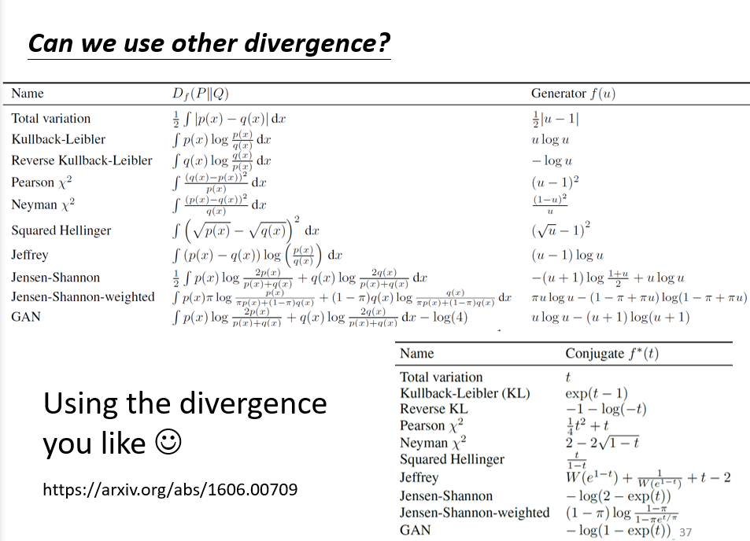

也可以修改G的objective function来得到不同的$Divergence$,而不是向原始GAN那样，但是GAN仍难TRAIN.

## Tips for Train

### JS Divergence is not suitable

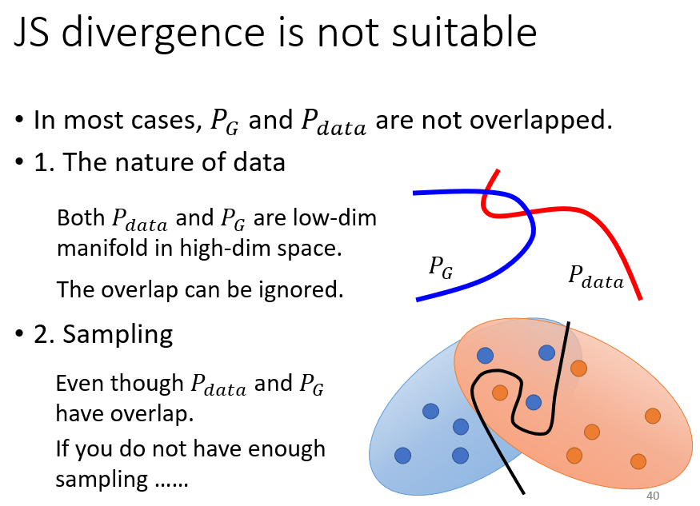

* 在大多数情况，$P_G,P_{data}$并不重叠

  * 数据本身的性质，以二次元头像为例，其应为高维空间的一个子空间（随便取个点都不会是二次元头像），就如同二维空间中的两条直线，其交集只有点
  * Sampling，如果不够密集就会将实际有重叠的空间划分成不重叠的空间，如上图所示，有重叠但是仍能找到一个边界划分两个分布。

  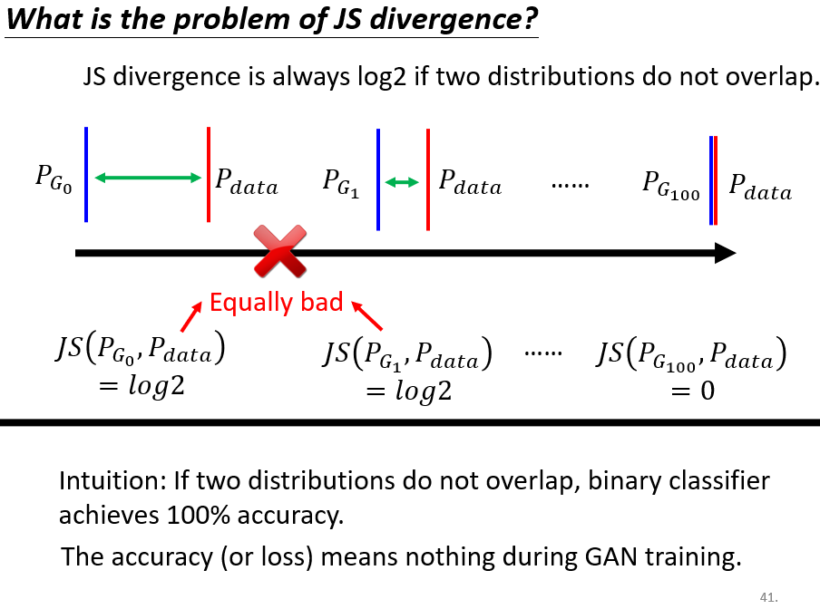

  $JS$ $Divergence$，在两个分布不重叠时，值永远为log2，就会导致，binary classifier 永远达到100%准确率，

  准确率和loss就变得没有意义，只能调出生成的图片。

### Wasserstein distance

  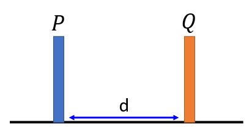

  想象推土机将分布Q推到P，其移动的距离就是 Wasserstein distance。即$W(P,Q) = d$

  对于复杂的分布

  

  移动的方式有多种，这时Wasserstein distance，就是移动最短方式所得的距离。即对于复杂的分布还需解一个最优化问题。

  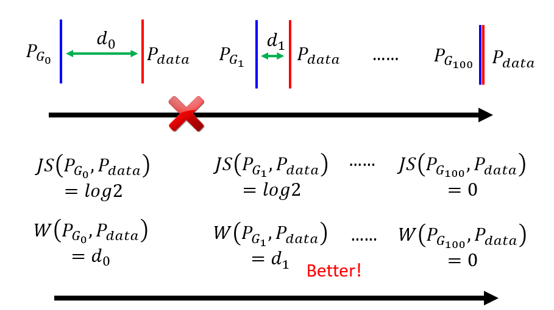

  这样对于上述$JS$ $Divergence$的问题就能够得到解决。

### WGAN

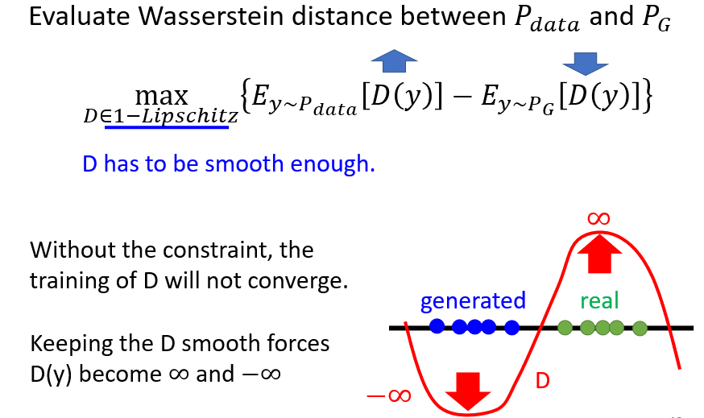

满足上述公式，但是要求D属于$1-Lipschitz$，这样能够使得D足够平滑（比连续更平滑，其斜率必小于一个称为Lipschitz常数的实数），如果两个分布差很多就会使得差距很大，如果分布差距很小由于$1-Lipschitz$的限制，上述式子就不会非常大。（就如图上的二次函数，如果差距很大那么它的峰可以更加的高，差距很小，他的峰由于限制不会变得比较小）如果不加对于上述式子只要使得real最大，generate最小就好了，对训练并没有帮助。

#### 如何实现

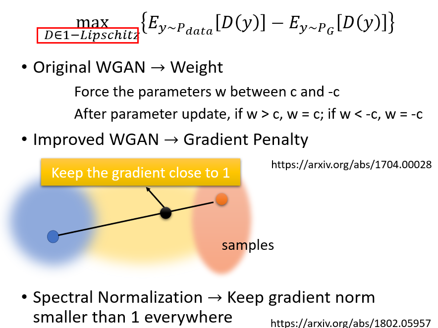

三种方法实现，第一种比较粗糙，强制缩放。

第三种能够计算出$Wasserstein$ $Distance$,详见[paper](https://arxiv.org/abs/1802.05957)

### *GAN is Still Challenging*

一旦某一次训练的loss不下降，G or D无法进一步提升，就会导致陷入死循环，network崩坏。

###  *More Tips*

[Tips from Soumith](https://github.com/soumith/ganhacks)

[Tips in DCGAN: Guideline for network architecture design for image generation](https://arxiv.org/abs/1511.06434)

[Improved techniques for training GANs](https://arxiv.org/abs/1606.03498)

[Tips from BigGAN](https://arxiv.org/abs/1809.11096)

###  *GAN for Sequence Generation*

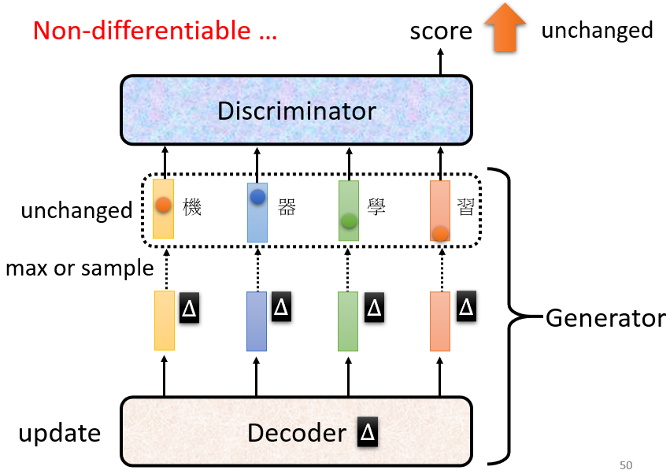

微小的改变不会使得*Generator*的输出的最大值发生变化，导致输出的字符一样，*Discriminator*输出*Score*不变，就无法进行梯度下降（不同的X对应相同的Y梯度为0）。

可以使用强化学习的方法硬train，强化学习也难train。会导致爆炸难train。

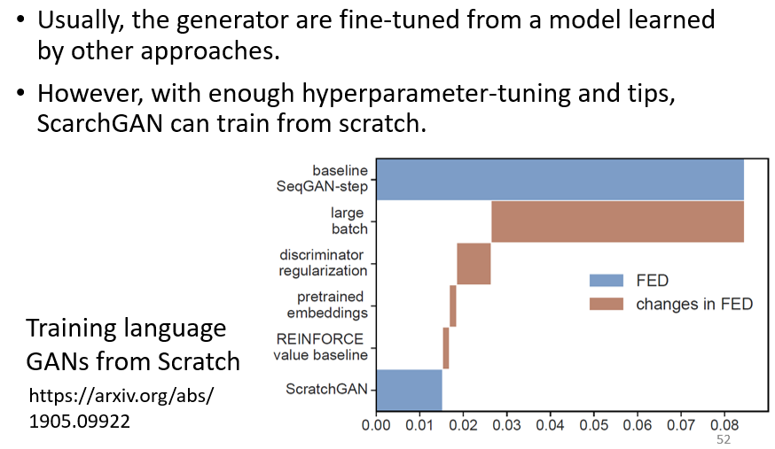

通常都需要pertrain，上述文献需要pertrain。使用了大量的tips。以及大量尝试超参。[文章链接](https://arxiv.org/abs/1905.09922)

### 其他解法

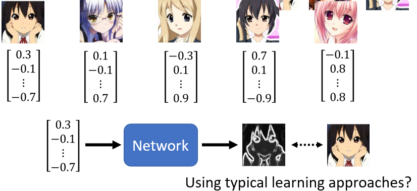

当作监督学习硬train。给每个图片一个对应的从高斯分布中sample的vector。对Vector有特殊的取法，随机就可能train不起来。

两篇参考

[Generative Latent Optimization](https://arxiv.org/abs/1707.05776)

[Gradient Origin Networks](https://arxiv.org/abs/2007.02798)

## Evaluation of Generation

### Quality of Image

* 早年都是人工来看，但这种方法昂贵且具有很多问题不客观等
* 对于一般的模型，可采用将产生的图片仍入一个影响辨识系统中，其输出产生的概率分布越集中越好则代表*Generator*越好

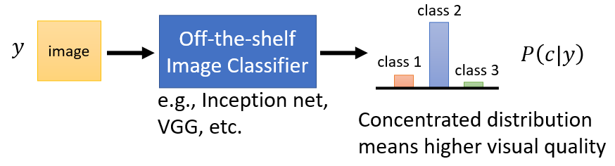

对于第二种方法，会被Mode Collapse 骗过。

### Diversity

#### Mode Collapse

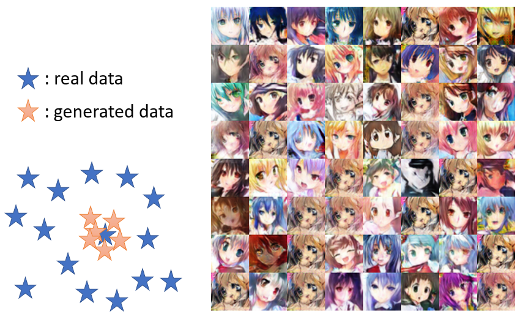

产生的数据分布包围真正的数据分布。如图片生成，只有那几张图片比较好，多产生几张就废掉。就会一直输出这几张图片。目前难以解决，BGAN谷歌只是每次储存参数，出现Mode Collapse就拿之前的参数来用，类似early stop。

#### Mode Dropping

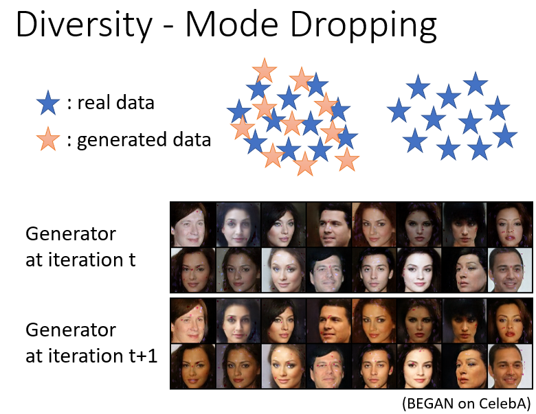

*Generator*产生的分布看似很好但其实只有真实分布的一部分。如下面的人脸，对肤色有缺失，每代的*Generator*只有部分的肤色。

#### Evaluation of Diversity

##### IS 

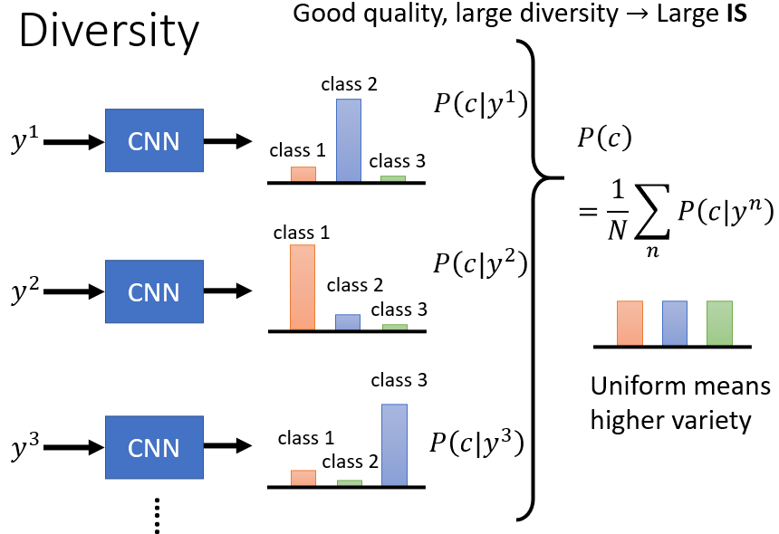

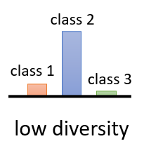

将产生的图片丢入图像分类系统，将产生的分布平均，如果得到较平均的分布，则说明多样性很好。如果单一则说明多样性不行。

**但这种方式对于特定的任务是有问题的。**比如对于生成不同人脸，即使人脸不同，放入影响识别系统都会被识别为人脸，就会得出多样性单一的结论。

##### FID

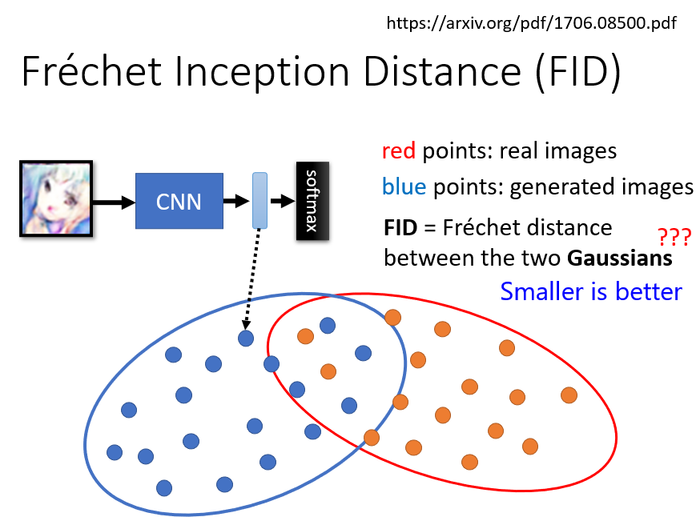

将生成的图片放入CNN，从输出层前一层将向量拿出。进行足够多的sample（一定要足够多，不然分布不可信）看作是Gaussians分布，将真实的数据和生成的数据计算[FID](https://arxiv.org/pdf/1706.08500.pdf),FID越小越好。

存在一些问题

1. sample 要足够多
2. 直接看作Gaussians有问题

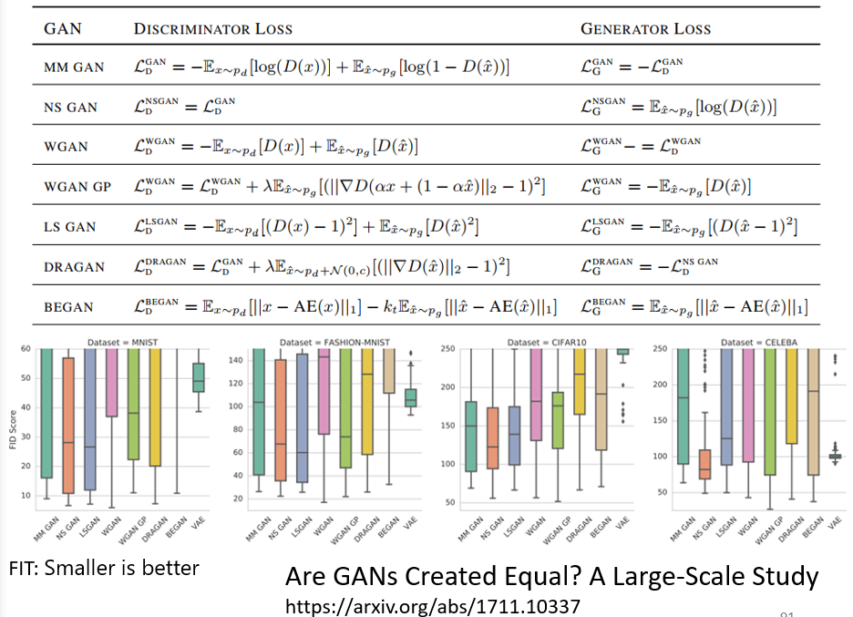

用不同的Random Seed，以及learning，同一个GAN的不同随机数种子结果差异很大，但是不同GAN的表现看起来好像是差不多的？难说，其中用的网络架构都是相同的。

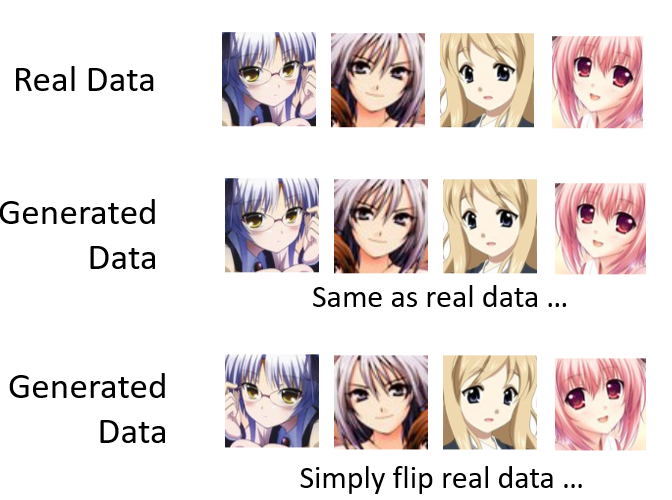

GAN的评估还是困难的。比如你产生的输出完全和真实的数据一样，FID很小但没用，GAN是要生成不存在的图片。

如果对图片做相似度也没用，可能generated只是翻转图片，你就无法检测。

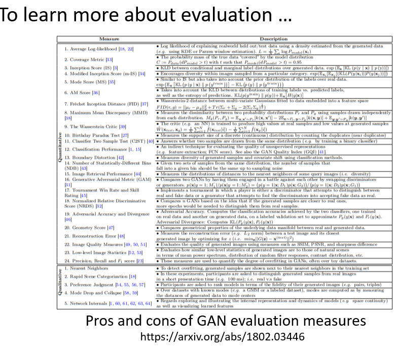

还有很多评估方法，也是个研究的课题。

## Conditional Generation

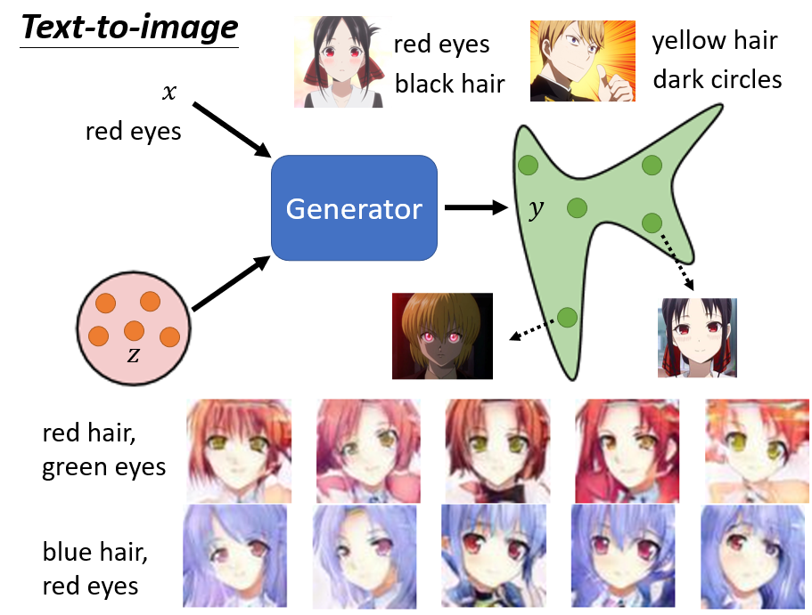

给定一个输入并结合一个简单的分布，生成一个分布。像是一个监督式学习，需要有label。

文字作为输入，扔进transformer的encoder将输出，平均作为x。

不能使用unconditional generation，会导致generator无视x。

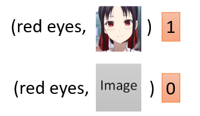

需要成对匹配的资料。但在实作上这样得到的结果不好，还需要清晰的图片加上乱配的资料。

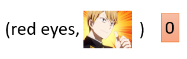

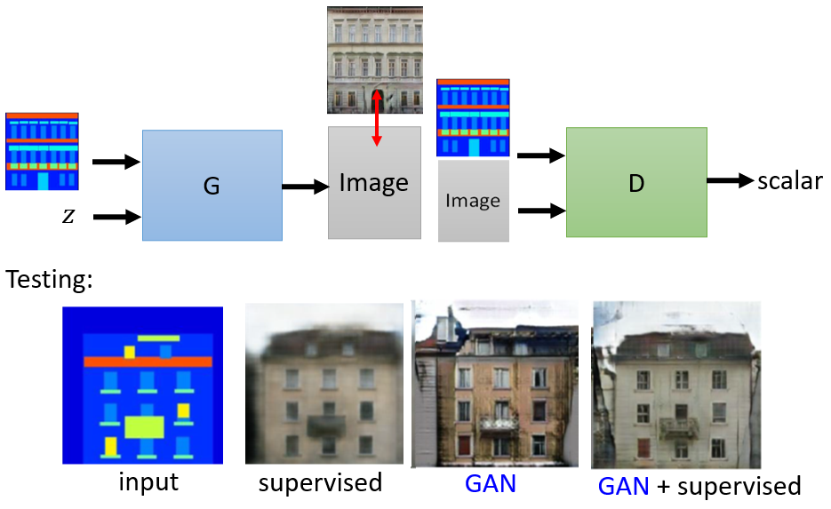

单纯的使用supervised learning 会使得图片模糊（因为一个输入多个输出），单用GAN想象力过于丰富，出现没有的东西。混合使用能得到的最好的结果，即既要使生成的图片骗过Discriminator 同时和真实的图片越接近越好。

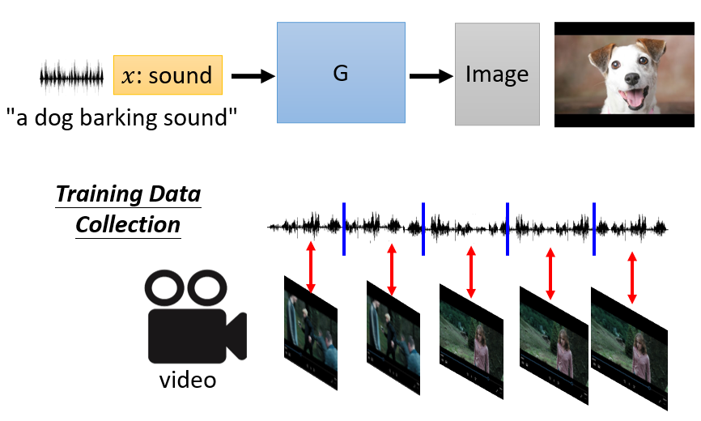

听到声音想象对应的图片是什么样子的。

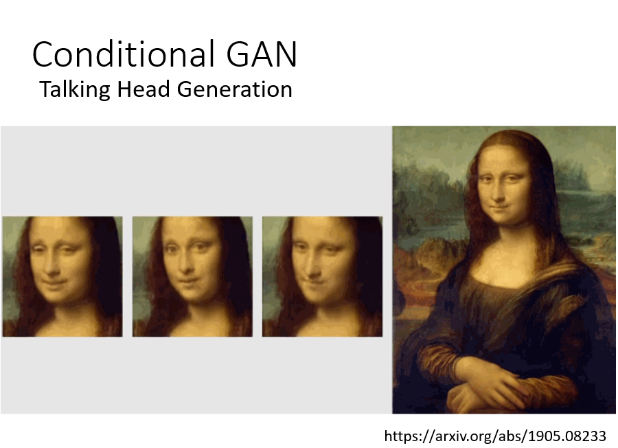

给图片产生会动的图片。

## Learning from Unpaired Data

 

#### 影像风格转换

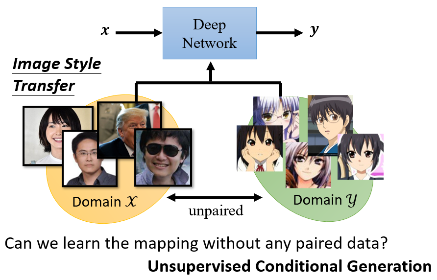

完全没有labeling

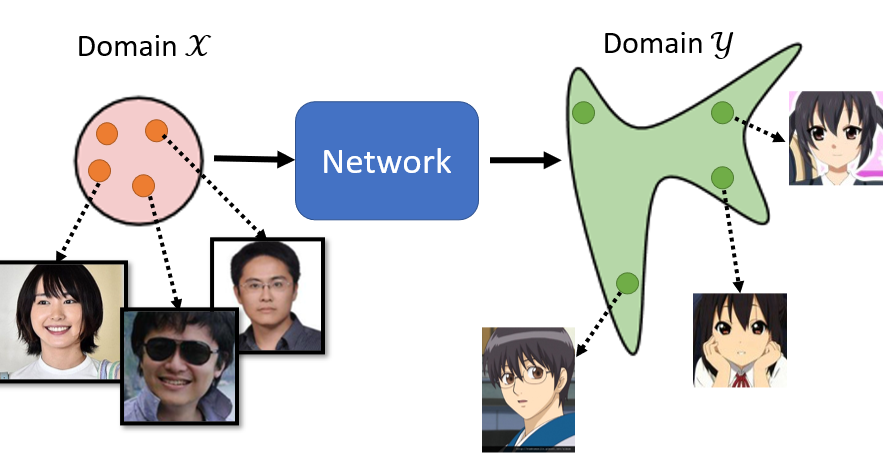

输入是真人图片的分布，输出是二次元头像的分布

#### Cycle GAN

如果单纯的套用最初始的GAN想法，即将输入的Gaussian的分布换成人脸的分布，再训练个Discriminator，去分辨生成和真实二次元脸，可能会得到能够生成二次元脸的G，但是会和输入没有关系。

在原始GAN的基础上，在加上一个从y到x的G，使得产生的图片和一开始的图片越接近越好，能够使得第一个G的输入和输出有联系。但这也有问题，可能第一个G生成红眼变白眼，第二个G读到白眼就将其变为红眼，这样就还是会使得第一个G的输入和输出有问题，但这种问题在实作上很难出现，即使不使用Cycle GAN 即不用第二个G，其实也能够完成这个任务。

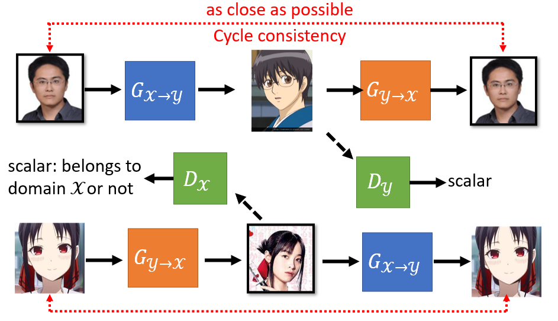

Cycle GAN 还能反着来。

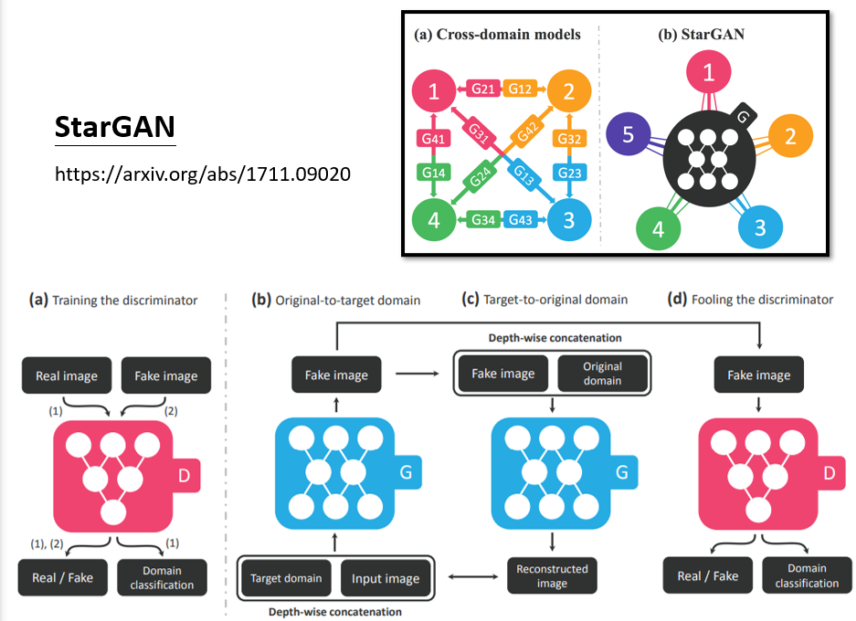

多种风格做转换。Cycle只能两种。

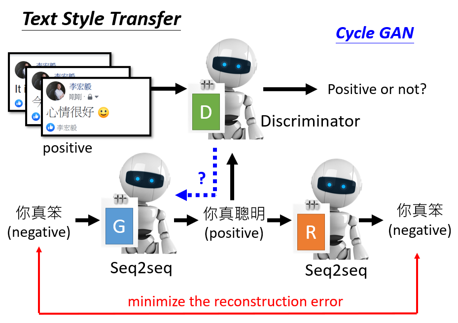

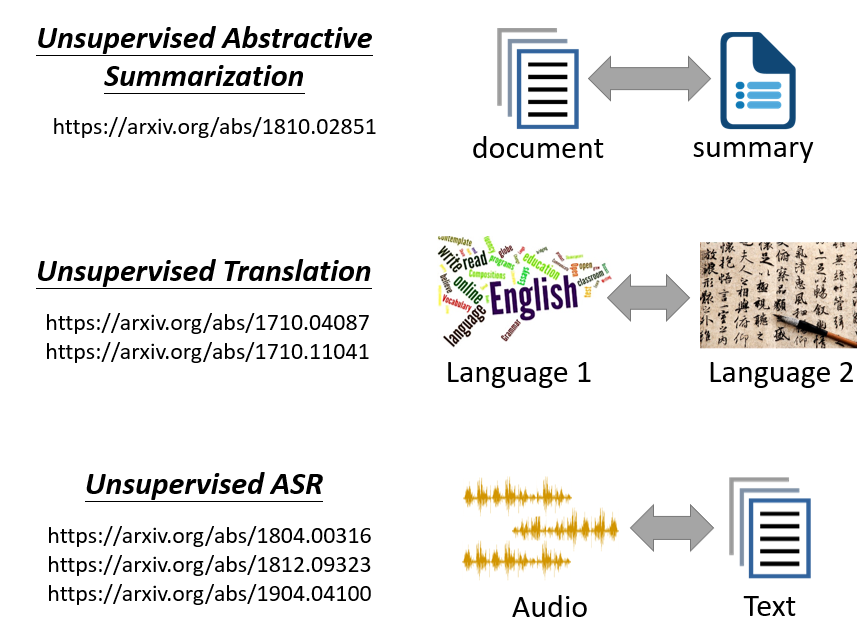

  

  

  

  

  