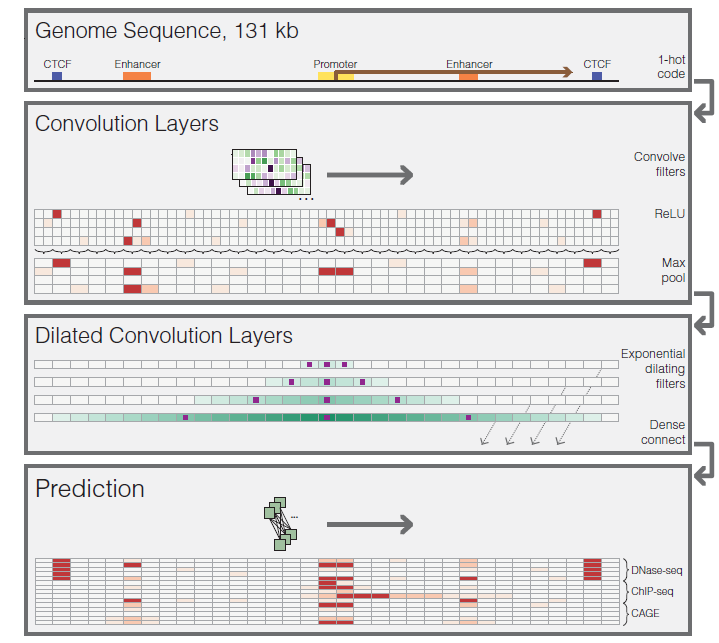
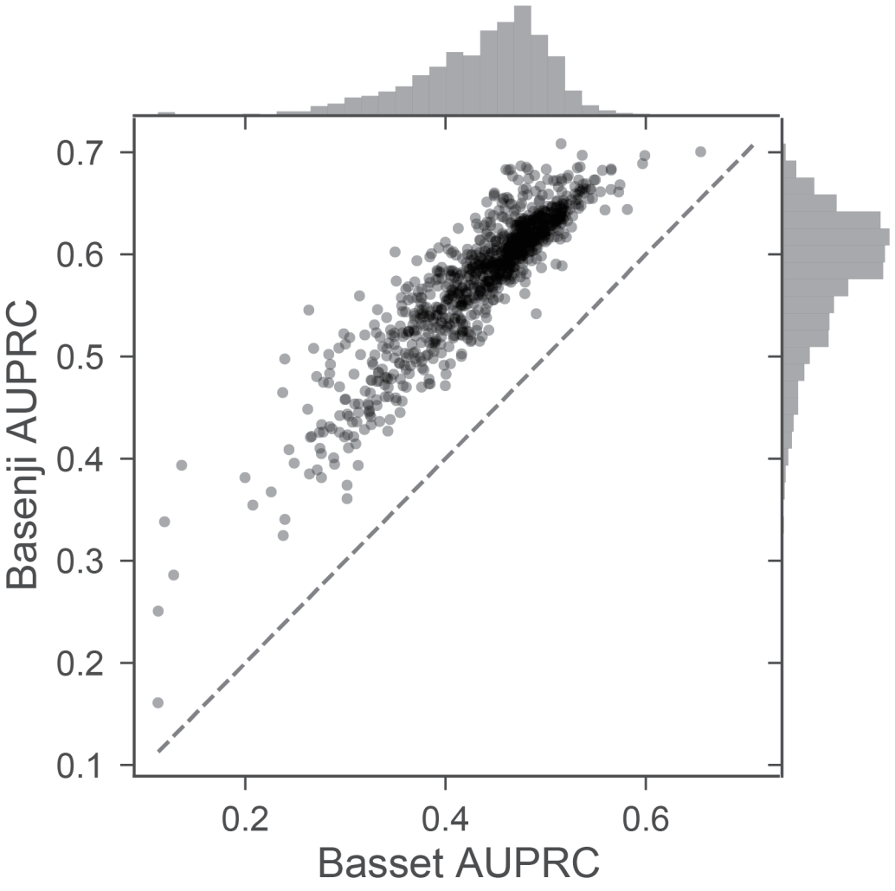

#### **Sequential regulatory activity prediction across chromosomes with convolutional neural networks.** Kelley DR, Reshef YA, Bileschi M, Belanger D, McLean CY, Snoek J. ***Genome Res*. 2018**,([PDF](E:/literature/Sequential regulatory activity prediction across chromosomes with convolutional neural networks.pdf))(Citation 51)

##### Result

###### Basenji

Model Features:
1)model distal regulatory interactions
2)predict finer-resolution, quantitative genomic profiles that are more appropriate for the dynamic range of gene expression.

several layers of convolution and max pooling to obtain representations that describe 128-bp bins.
several layers of dilated convolutions to share information across large distances.
a final width-one convolutional layer to parameterize a multitask Poisson regression on normalized counts of aligned reads.

Modeling count data required careful preprocessing beyond that performed in the standard pipelines of genomics consortium projects.

###### Prediction accuracy

**Accuracy varies by the type of data**:
1)Punctate peak data tend to be more directly dependent on the underlying sequence, making for an easier prediction task.
2)broad chromatin domains marked by modifications like H3K79me2 and H3K9me3 is expected because they depend more on distant sequence signals and incompletely understood propagation mechanisms.
3)Basenji tends to overestimate at the low coverage end and underestimate at the high coverage end due to an implicit regularization of the noisy experimental measurements.

Basset vs Basenji 

divide long sequence to short subsequence for basset.

The mean and median prediction correlation exceeded the replicate correlation

